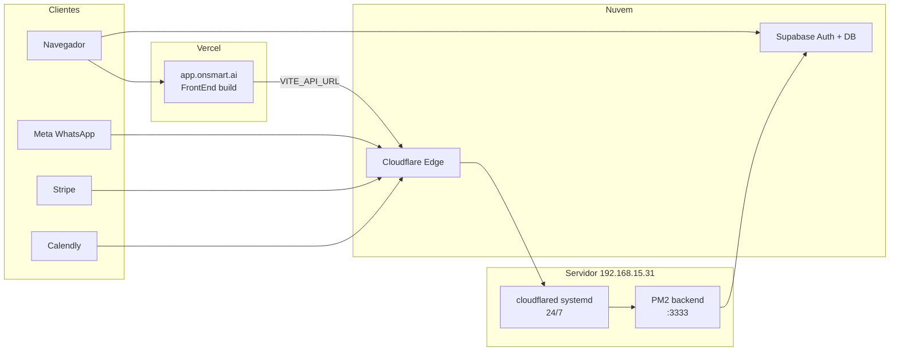

# Plano BETA Sonia — PM2 + Cloudflare Tunnel + Vercel

> **Status:** rascunho — não executado. Retomar quando for buildar a BETA.

## Arquitetura alvo



**Subdomínios propostos (onsmart.ai):**

| Subdomínio | Destino | Uso |
|------------|---------|-----|
| `app.onsmart.ai` | Vercel | UI da plataforma (BETA) |
| `api.onsmart.ai` | Cloudflare Tunnel → `localhost:3333` | REST API (`VITE_API_URL`) |
| `webhook.onsmart.ai` | Mesmo túnel → `:3333` | Webhooks Meta / Stripe / Calendly |

> O script atual `BackEnd/scripts/setup-cloudflare-tunnel.sh` cria **um** hostname por execução. Para BETA, o `~/.cloudflared/config.yml` deve listar **dois** ingress rules (`api` + `webhook`) apontando para `http://localhost:3333`.

---

## Fase 0 — Pré-requisitos (antes de tocar produção)

- [ ] Zona DNS `onsmart.ai` gerenciada na **Cloudflare** (túnel permanente exige isso).
- [ ] Acesso SSH ao servidor (`servidoronsmart@192.168.15.31`) + keep-alive no cliente Windows.
- [ ] Conta **Vercel** conectada ao repositório Git.
- [ ] `.env` de produção **já existente no servidor** (preservado pelo `deploy-backend-server.ps1` — nunca commitar).
- [ ] Decidir URL preview Vercel (`*.vercel.app`) para testes antes do DNS final.

---

## Fase 1 — Backend 24/7 com PM2 (servidor)

### 1.1 Primeiro deploy (ou validar estado atual)

No PC de desenvolvimento:

```powershell
.\deploy-backend-server.ps1 -RunLocalBuild
```

### 1.2 Boot automático PM2 (uma vez no servidor)

```bash
cd ~/plataform-backend/BackEnd
pm2 startup    # executar o comando sudo que aparecer
pm2 save
pm2 status backend
curl -s http://127.0.0.1:3333/billing/webhook/test   # só em NODE_ENV != production
```

### 1.3 Variáveis críticas no `.env` do servidor

```env
NODE_ENV=production
TRUST_PROXY_HTTPS=true
CORS_ALLOWED_ORIGINS=https://app.onsmart.ai,https://<projeto>.vercel.app
```

---

## Fase 2 — Cloudflare Tunnel permanente (cloudflared)

### 2.2 Config multi-hostname (permanente)

```yaml
tunnel: <TUNNEL_ID>
credentials-file: ~/.cloudflared/<TUNNEL_ID>.json

ingress:
  - hostname: api.onsmart.ai
    service: http://localhost:3333
  - hostname: webhook.onsmart.ai
    service: http://localhost:3333
  - service: http_status:404
```

```bash
cloudflared tunnel route dns <TUNNEL_NAME> api.onsmart.ai
cloudflared tunnel route dns <TUNNEL_NAME> webhook.onsmart.ai
sudo systemctl restart cloudflared
sudo systemctl enable cloudflared
```

---

## Fase 3 — Frontend na Vercel (`app.onsmart.ai`)

- **Root Directory:** `FrontEnd`
- **Framework:** Vite
- **Build Command:** `npm run build`
- **Output Directory:** `build`
- **Branch de produção:** `main`

### Environment Variables (Production)

```env
VITE_SUPABASE_URL=https://<projeto>.supabase.co
VITE_SUPABASE_ANON_KEY=<anon_key>
VITE_API_URL=https://api.onsmart.ai
VITE_BACKEND_PUBLIC_URL=https://webhook.onsmart.ai
```

### Supabase Auth (bloqueia login se faltar)

- **Site URL:** `https://app.onsmart.ai`
- **Redirect URLs:** `https://app.onsmart.ai/**`, `https://*.vercel.app/**`

---

## Fase 4 — Smoke test BETA (go/no-go)

| # | Teste | Esperado |
|---|--------|----------|
| 1 | Abrir `https://app.onsmart.ai` | UI carrega, sem erro CSP/CORS |
| 2 | Login / cadastro | Redirect Supabase OK |
| 3 | Dashboard / agentes | Chamadas a `https://api.onsmart.ai` 200 |
| 4 | Playground | Mensagem ao agente |
| 5 | WhatsApp (se piloto usar) | Meta callback `https://webhook.onsmart.ai/whatsapp/webhook` |
| 6 | PM2 + cloudflared após reboot servidor | `systemctl status cloudflared`; `pm2 status` |

---

## Ordem de execução recomendada

1. PM2 estável + `.env` produção no servidor
2. Cloudflare Tunnel (`api` + `webhook`) + testes curl
3. Vercel build + env vars + domínio `app.onsmart.ai`
4. Supabase Auth URLs + CORS backend
5. Smoke test completo
6. Atualizar `.claude/rules/dependencias-producao-pendentes.md`
7. Liberar URL ao cliente piloto (15 dias)
