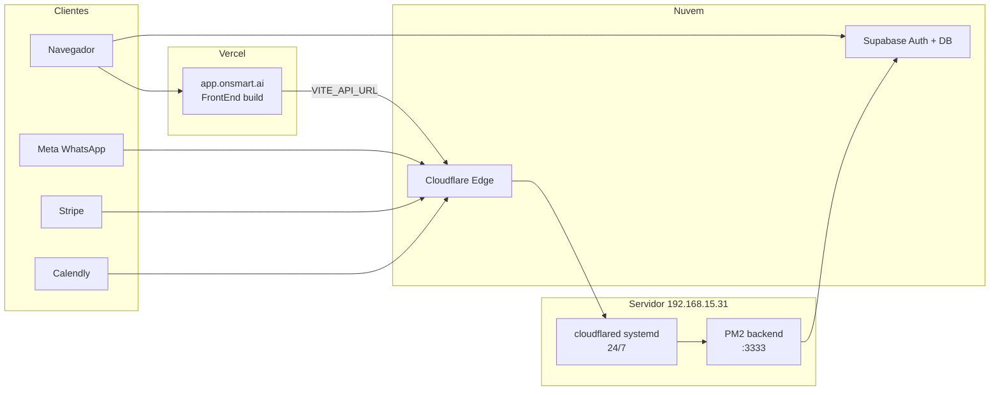

# Plano BETA Sonia — PM2 + Cloudflare Tunnel + Vercel

> **Status:** rascunho — não executado. Retomar quando for buildar a BETA.

## Arquitetura alvo



**Subdomínios propostos (onsmart.ai):**

| Subdomínio | Destino | Uso |
|------------|---------|-----|
| `app.onsmart.ai` | Vercel | UI da plataforma (BETA) |
| `api.onsmart.ai` | Cloudflare Tunnel → `localhost:3333` | REST API (`VITE_API_URL`) |
| `webhook.onsmart.ai` | Mesmo túnel → `:3333` | Webhooks Meta / Stripe / Calendly (já documentado em [docs/informacoes-cruciais-integracoes-webhooks.md](../../docs/informacoes-cruciais-integracoes-webhooks.md)) |

> O script atual [BackEnd/scripts/setup-cloudflare-tunnel.sh](../../BackEnd/scripts/setup-cloudflare-tunnel.sh) cria **um** hostname por execução. Para BETA, o `~/.cloudflared/config.yml` deve listar **dois** ingress rules (`api` + `webhook`) apontando para `http://localhost:3333`. Referência: [BackEnd/cloudflared-config.yml.template](../../BackEnd/cloudflared-config.yml.template) e [BackEnd/scripts/corrigir-tunel-webhook.sh](../../BackEnd/scripts/corrigir-tunel-webhook.sh).

---

## Fase 0 — Pré-requisitos (antes de tocar produção)

- [ ] Zona DNS `onsmart.ai` gerenciada na **Cloudflare** (túnel permanente exige isso).
- [ ] Acesso SSH ao servidor (`servidoronsmart@192.168.15.31`) + keep-alive no cliente Windows (já listado em [.cursor/rules/dependencias-producao-pendentes.mdc](../rules/dependencias-producao-pendentes.mdc)).
- [ ] Conta **Vercel** conectada ao repositório Git.
- [ ] `.env` de produção **já existente no servidor** (preservado pelo [deploy-backend-server.ps1](../../deploy-backend-server.ps1) — nunca commitar).
- [ ] Decidir URL preview Vercel (`*.vercel.app`) para testes antes do DNS final.

---

## Fase 1 — Backend 24/7 com PM2 (servidor)

### 1.1 Primeiro deploy (ou validar estado atual)

No PC de desenvolvimento:

```powershell
.\deploy-backend-server.ps1 -RunLocalBuild
```

O script envia `BackEnd/`, roda `npm ci` + `npm run build`, reinicia PM2 via [BackEnd/ecosystem.config.cjs](../../BackEnd/ecosystem.config.cjs) (`name: backend`, `script: dist/index.js`).

### 1.2 Boot automático PM2 (uma vez no servidor)

```bash
cd ~/plataform-backend/BackEnd
pm2 startup    # executar o comando sudo que aparecer
pm2 save
pm2 status backend
curl -s http://127.0.0.1:3333/billing/webhook/test   # só em NODE_ENV != production
```

### 1.3 Variáveis críticas no `.env` do servidor

Alinhar com [BackEnd/src/index.ts](../../BackEnd/src/index.ts):

```env
NODE_ENV=production
TRUST_PROXY_HTTPS=true
CORS_ALLOWED_ORIGINS=https://app.onsmart.ai,https://<projeto>.vercel.app
```

Demais vars (Supabase service role, Meta, Stripe, Anthropic, etc.) conforme ambiente já usado hoje.

**Validação:** `pm2 logs backend --lines 50` sem crash loop; worker WhatsApp inicia (`startQueueWorker` no index).

---

## Fase 2 — Cloudflare Tunnel permanente (cloudflared)

### 2.1 Instalar / validar túnel

No servidor (como root):

```bash
cd ~/plataform-backend/BackEnd
sudo ./scripts/setup-cloudflare-tunnel.sh   # se túnel ainda não existir
# OU scripts existentes: verificar-tunel.sh, corrigir-tunel-webhook.sh
```

### 2.2 Config multi-hostname (permanente)

Editar `~/.cloudflared/config.yml` para incluir **api** e **webhook**:

```yaml
tunnel: <TUNNEL_ID>
credentials-file: ~/.cloudflared/<TUNNEL_ID>.json

ingress:
  - hostname: api.onsmart.ai
    service: http://localhost:3333
  - hostname: webhook.onsmart.ai
    service: http://localhost:3333
  - service: http_status:404
```

Registrar DNS (se ainda não existir):

```bash
cloudflared tunnel route dns <TUNNEL_NAME> api.onsmart.ai
cloudflared tunnel route dns <TUNNEL_NAME> webhook.onsmart.ai
sudo systemctl restart cloudflared
sudo systemctl enable cloudflared
```

**Validação:** scripts [BackEnd/scripts/testar-tudo.sh](../../BackEnd/scripts/testar-tudo.sh) e [BackEnd/scripts/verificar-webhook-url.sh](../../BackEnd/scripts/verificar-webhook-url.sh):

```bash
curl -I https://api.onsmart.ai/billing/webhook/test   # se endpoint de teste ativo
curl -I https://webhook.onsmart.ai/whatsapp/webhook
```

---

## Fase 3 — Frontend na Vercel (`app.onsmart.ai`)

### 3.1 Configuração do projeto Vercel

- **Root Directory:** `FrontEnd`
- **Framework:** Vite
- **Build Command:** `npm run build`
- **Output Directory:** `build` (definido em [FrontEnd/vite.config.ts](../../FrontEnd/vite.config.ts))
- **Branch de produção:** `main` (deploy automático a cada push — branches extras opcionais para preview)

### 3.2 Environment Variables (Production)

```env
VITE_SUPABASE_URL=https://<projeto>.supabase.co
VITE_SUPABASE_ANON_KEY=<anon_key>
VITE_API_URL=https://api.onsmart.ai
VITE_BACKEND_PUBLIC_URL=https://webhook.onsmart.ai
```

Usado em [FrontEnd/src/services/api.ts](../../FrontEnd/src/services/api.ts) — `VITE_*` é **embutido no build**; qualquer mudança exige redeploy na Vercel.

CSP do build já considera `VITE_API_URL` em [FrontEnd/vite.config.ts](../../FrontEnd/vite.config.ts).

### 3.3 Domínio customizado

Vercel → Project → Domains → `app.onsmart.ai` (CNAME conforme instruções Vercel).

### 3.4 Supabase Auth (bloqueia login se faltar)

Supabase Dashboard → Authentication → URL Configuration:

- **Site URL:** `https://app.onsmart.ai`
- **Redirect URLs:** `https://app.onsmart.ai/**`, `https://*.vercel.app/**` (preview)

Cruza com item P0 já existente na rule de dependências.

---

## Fase 4 — Smoke test BETA (go/no-go)

Checklist manual antes de passar URL ao cliente (15 dias):

| # | Teste | Esperado |
|---|--------|----------|
| 1 | Abrir `https://app.onsmart.ai` | UI carrega, sem erro CSP/CORS |
| 2 | Login / cadastro | Redirect Supabase OK |
| 3 | Dashboard / agentes | Chamadas a `https://api.onsmart.ai` 200 |
| 4 | Playground | Mensagem ao agente |
| 5 | WhatsApp (se piloto usar) | Meta callback `https://webhook.onsmart.ai/whatsapp/webhook` |
| 6 | PM2 + cloudflared após reboot servidor | `systemctl status cloudflared`; `pm2 status` |

---

## Fase 5 — Operação durante a BETA (15 dias)

### Atualizar backend

```powershell
.\deploy-backend-server.ps1
```

Preserva `.env`, rebuild, `pm2 restart ecosystem.config.cjs`.

### Atualizar frontend

Push na `main` → Vercel redeploy automático.  
Hotfix urgente: Redeploy manual no painel Vercel.

### Branches (recomendação leve)

- **`main`** → produção BETA (`app.onsmart.ai`)
- **PR / branch feature** → Preview URL Vercel (testar sem afetar cliente)
- Não é obrigatório `staging` separado para piloto de 15 dias.

### Monitoramento mínimo

- `pm2 logs backend --lines 100`
- `sudo journalctl -u cloudflared -f`
- Supabase logs + limites de plano do cliente piloto

---

## Fase 6 — Atualizar rule de dependências (ao executar o plano)

Editar [.cursor/rules/dependencias-producao-pendentes.mdc](../rules/dependencias-producao-pendentes.mdc):

1. Adicionar seção **`## P0 — BETA Sonia (go-live onsmart.ai)`** com checklist espelhando as fases acima.
2. Marcar como `[~]` itens parcialmente cobertos.
3. Cruzar com P0 existentes (SMTP Auth, `VITE_API_URL`, PM2 boot, etc.).
4. Referenciar este plano: `.cursor/plans/beta-sonia-deploy.plan.md`

**Opcional (código):** criar [FrontEnd/vercel.json](../../FrontEnd/vercel.json) com rewrites SPA se refresh de rotas falhar.

---

## Riscos conhecidos (transparência)

- **IP privado `192.168.15.31`:** clientes na internet **nunca** acessam esse IP; só Vercel + túnel Cloudflare.
- **Carência 24h de retenção (Governança):** texto de UI; purge real é imediato por idade — não bloqueia BETA.
- **Stripe live / SMTP Auth:** ainda P0 na rule; BETA pode rodar sem checkout live se plano do cliente for configurado manualmente no Supabase.
- **Hardcode `192.168.15.31` em** [FrontEnd/src/services/api.ts](../../FrontEnd/src/services/api.ts): irrelevante em produção se `VITE_API_URL` estiver setado na Vercel.

---

## Ordem de execução recomendada

1. PM2 estável + `.env` produção no servidor
2. Cloudflare Tunnel (`api` + `webhook`) + testes curl
3. Vercel build + env vars + domínio `app.onsmart.ai`
4. Supabase Auth URLs + CORS backend
5. Smoke test completo
6. Atualizar `.cursor/rules/dependencias-producao-pendentes.mdc`
7. Liberar URL ao cliente piloto (15 dias)
