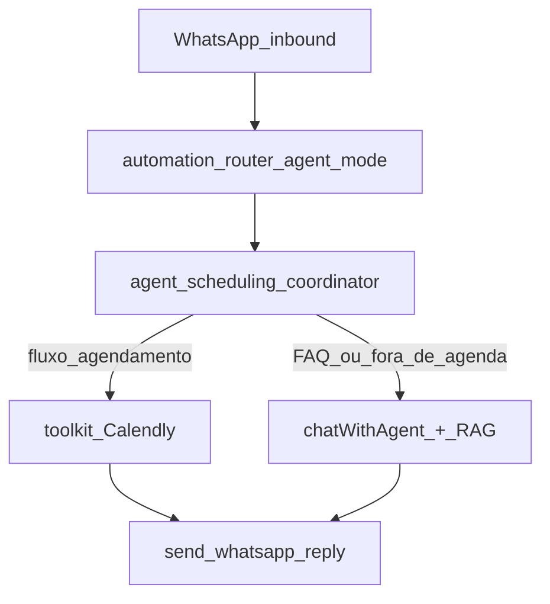

# Demo Onsmart — agente único receptivo + Calendly no chat

## Contexto (o que o código já tem)

- **Calendly funcional** via `[BackEnd/src/services/integrations/toolkit/toolkit.service.ts](BackEnd/src/services/integrations/toolkit/toolkit.service.ts)` (`check_availability`, `book_appointment`) e `[BackEnd/src/services/integrations/calendly/calendly.provider.ts](BackEnd/src/services/integrations/calendly/calendly.provider.ts)`.
- **Clínica** usa isso só em **fluxos** (`appointment` nodes + pausa para escolher slot) — ver `[BackEnd/src/services/flows/flow-provision-medical-clinic.service.ts](BackEnd/src/services/flows/flow-provision-medical-clinic.service.ts)`.
- **Agente direto no WhatsApp** existe (`automation_mode: agent` em `[BackEnd/src/services/automation/automation-router.ts](BackEnd/src/services/automation/automation-router.ts)` → `[chatwithAgent.ts](BackEnd/src/services/agents/chatwithAgent.ts)`), mas **sem ações Calendly** no schema JSON atual (só `reply`, `send_whatsapp`, email, leitura WA).

**Conclusão:** é viável sem redesenhar o editor de fluxos agora; o caminho é um **coordenador de agendamento no runtime do agente** + **provisionamento** de template/agente + **RAG** — alinhado ao seu objetivo de demo simples, com o “bloco ElevenLabs” evoluindo em fase 2.




---

## Escopo da demo (Fase 1 — funcional)


| Incluído                                                                           | Fora desta fase                                       |
| ---------------------------------------------------------------------------------- | ----------------------------------------------------- |
| 1 template + 1 agente Onsmart provisionados                                        | Retrabalho completo do editor de fluxos               |
| WhatsApp em modo **agent** (sem `linked_flow_id`)                                  | Múltiplos subfluxos / menus numerados da clínica      |
| FAQ: prompt curado + arquivos RAG do site                                          | CRM/email automáticos (opcional depois)               |
| Agendamento: coletar nome, telefone, e-mail → validar slot → book ou listar semana | UI estilo ElevenLabs com cards de integração (Fase 2) |
| Mensagem inicial automática no primeiro contato                                    | Cancelar/remarcar via agente                          |


**Premissas confirmadas:** Event Type Calendly já existe; conhecimento = **prompt + RAG**.

---

## Comportamento conversacional (regras de produto)

### Mensagem inicial (primeiro contato sem histórico)

Proposta (PT-BR, WhatsApp):

> Olá! Tudo bem? Eu sou a **Sonia**, assistente virtual da **Onsmart.AI**.  
> Posso esclarecer dúvidas sobre nossas soluções de **tecnologia e IA**, ou **agendar uma conversa** com nosso time — direto aqui no WhatsApp.  
> Como posso ajudar você hoje?

Implementação: detectar histórico vazio no Redis/DB antes do LLM e enviar essa mensagem (sem depender do modelo “inventar” o greeting).

### FAQ (fora de agendamento)

- Responder **somente** sobre tecnologia/IA e serviços alinhados ao site [www.onsmart.ai](https://www.onsmart.ai).
- Se pergunta fora do escopo: redirecionar educadamente para o site ou para agendar conversa.
- **RAG:** upload de 1–3 arquivos (FAQ curado + trechos do site) em `tb_agent_files` do agente provisionado; `consultarArquivos` já usado em `chatWithAgent`.

### Gatilhos de agendamento

Palavras/intenções (PT): `agendar`, `agendamento`, `diagnóstico`, `diagnostico`, `reunião`, `marcar`, `horário`, `conversar com time`, etc.

Fluxo:

1. Agradecer interesse.
2. **Coletar identidade** (obrigatório antes do book): nome completo, telefone, e-mail — validação mínima (e-mail válido, telefone ≥10 dígitos), reutilizando lógica similar a `[flow-patient-intake.ts](BackEnd/src/services/flows/flow-patient-intake.ts)`.
3. Perguntar **dia e horário** desejados (linguagem natural).
4. **Extrair data/hora** com chamada LLM estruturada pequena (campos: `date`, `time`, `timezone`) — não confiar só no texto livre para bater no Calendly.
5. `check_availability` para a data pedida (specialty mapeada no Calendly).
6. Se slot exato existir → `book_appointment` na hora + confirmação com data/hora e link se o provider retornar.
7. Se não existir → mensagem clara + **listar disponibilidade da semana** (reutilizar formatação de `[buildAppointmentSlotSelectionMessage](BackEnd/src/services/flows/flow-appointment-selection.ts)`, adaptada para “escolha número ou informe outro horário”).
8. Proibir alucinação: instruções explícitas no template — **nunca** confirmar horário sem retorno `success` do toolkit.

**Mapeamento Calendly:** você já tem Event Type; no plano usamos um slug fixo, ex. `reuniao_diagnostico` (ou o slug que você já configurou em `event_type_mappings` na integração). Documentar no provisionamento qual specialty usar.

---

## Arquitetura técnica (Fase 1)

### 1) Config do agente (sem migration obrigatória na demo)

Armazenar bindings em `tb_agents.extra_features` (JSON documentado), exemplo:

```json
{
  "demo": "onsmart_sonia",
  "welcome_message": "...",
  "scheduling": {
    "enabled": true,
    "calendly_integration_id": "<uuid>",
    "specialty": "reuniao_diagnostico"
  },
  "knowledge": { "scope": "onsmart_ai_only" }
}
```

- `integrations_id` do agente = WhatsApp (já existente).
- Calendly **não** fica em `integrations_id`; fica em `scheduling.calendly_integration_id`.

### 2) Novo serviço: coordenador de agendamento

Arquivo sugerido: `[BackEnd/src/services/agents/agent-scheduling-coordinator.ts](BackEnd/src/services/agents/agent-scheduling-coordinator.ts)`

- Estado em Redis (chave por `agentId + whatsapp_contact_id`), estados: `idle` → `collecting_identity` → `awaiting_datetime` → `offering_slots` → `booking` → `done`.
- Entrada: `processSchedulingTurn({ agent, message, contactId, companiesId })` retorna `{ handled: boolean, reply: string }`.
- Internamente chama `executeIntegrationTool` (Calendly) — **não duplicar** HTTP Calendly.
- Parsing de identidade: reaproveitar funções de intake ou extrair para util compartilhado.

### 3) Integração no caminho WhatsApp

Em `[automation-router.ts](BackEnd/src/services/automation/automation-router.ts)` → `executeAgentAutomation`:

1. Carregar agente + parse `extra_features`.
2. Se `scheduling.enabled`, chamar coordenador **antes** de `chatWithAgent`.
3. Se `handled`, enviar resposta e retornar; senão, seguir FAQ normal.

Primeiro contato: se histórico vazio, enviar `welcome_message` e salvar no histórico Redis.

### 4) Provisionamento “one-click” da demo

Novo serviço espelhando o padrão da clínica: `[BackEnd/src/services/agents/provision-onsmart-demo.service.ts](BackEnd/src/services/agents/provision-onsmart-demo.service.ts)`

- Cria **template** “Onsmart — Sonia Receptiva + Agenda” com `role` longo (FAQ + regras de agendamento + proibições).
- Cria **agente** com `personality_prompt`, `extra_features`, `integrations_id` (WA), opcional `crm_integration_id`.
- **Não** cria fluxo em `tb_flows`.
- Endpoint admin: `POST /agents/provision-onsmart-demo` (auth admin), body: `calendlyIntegrationId`, `whatsappIntegrationId`, `specialty?`.

Controller: estender `[BackEnd/src/api/controllers/agents.controller.ts](BackEnd/src/api/controllers/agents.controller.ts)` ou novo arquivo de rotas.

### 5) FrontEnd (mínimo para operar a demo)

- Botão/ação em `[FrontEnd/src/pages/AgentsHub.tsx](FrontEnd/src/pages/AgentsHub.tsx)` ou Configurações: “Provisionar demo Onsmart” (chama API + toast com IDs).
- Garantir upload de KB na tela existente `[FrontEnd/src/pages/AgentConfig.tsx](FrontEnd/src/pages/AgentConfig.tsx)` (arquivos RAG).
- Integrações: `[FrontEnd/src/components/configuration/Integrations.tsx](FrontEnd/src/components/configuration/Integrations.tsx)` — modo **Agente**, agente provisionado vinculado, **sem** fluxo linkado.
- Calendly: `[CalendlyIntegrationSheet.tsx](FrontEnd/src/components/configuration/CalendlyIntegrationSheet.tsx)` — confirmar mapping do Event Type existente para `reuniao_diagnostico` (ou slug acordado).

### 6) Testes

- Unit: coordenador (coleta identidade, transição de estados, mock toolkit).
- Unit: provision (template/agent criados, `extra_features` válido).
- Manual: Playground agent + WhatsApp real com Calendly de teste.

---

## Fase 2 (paralelo futuro — “bloco ElevenLabs”)

Objetivo alinhado ao que você descreveu, **sem bloquear a demo**:


| Item               | Descrição                                                                                                             |
| ------------------ | --------------------------------------------------------------------------------------------------------------------- |
| UI do agente       | Seção “Integrações” no agente: Calendly / CRM / E-mail com toggles + campos (specialty, templates)                    |
| Prompt builder     | `[prompt-builder.ts](BackEnd/src/services/agents/prompt-builder.ts)` injeta bloco dinâmico por integração ativa       |
| Schema LLM         | Evoluir `AGENT_RESPONSE_SCHEMA` com ações tipadas ou tool-loop; hoje Fase 1 evita isso com coordenador determinístico |
| `AgentConfigSheet` | Reativar ou migrar para `AgentConfig` — hoje `personality_prompt` está órfão no front                                 |


---

## Checklist de aceite da demo

- WhatsApp com integração em modo **agent** responde greeting na primeira mensagem do contato.
- Perguntas sobre Onsmart usam RAG + prompt; não inventa serviços fora do escopo.
- Usuário pede agendamento → coleta nome, telefone, e-mail → pergunta dia/hora.
- Horário disponível → evento criado no Calendly + confirmação no chat.
- Horário indisponível → avisa e lista opções da semana (formato legível).
- Nenhum fluxo `tb_flows` necessário para o cenário.
- Provisionamento recriável via API para outro ambiente de teste.

---

## Ordem de implementação sugerida

1. Template + `extra_features` schema + provision API
2. Coordenador Redis + toolkit Calendly + testes unitários
3. Hook no `automation-router` + welcome message
4. Conteúdo RAG (seed operacional: FAQ markdown curto + instrução de upload do site)
5. Front: botão provision + checklist Integrações/Calendly
6. Teste manual WhatsApp ponta a ponta

## Riscos e mitigação


| Risco                            | Mitigação                                                 |
| -------------------------------- | --------------------------------------------------------- |
| LLM erra data/hora em PT         | Extração estruturada + confirmação antes do book          |
| Agente confirma sem book         | Coordenador só confirma após `book_appointment` success   |
| `extra_features` sem validação   | Zod/schema no provision + defaults                        |
| Histórico Redis vs DB divergente | Persistir estado de agendamento só no coordenador (Redis) |


