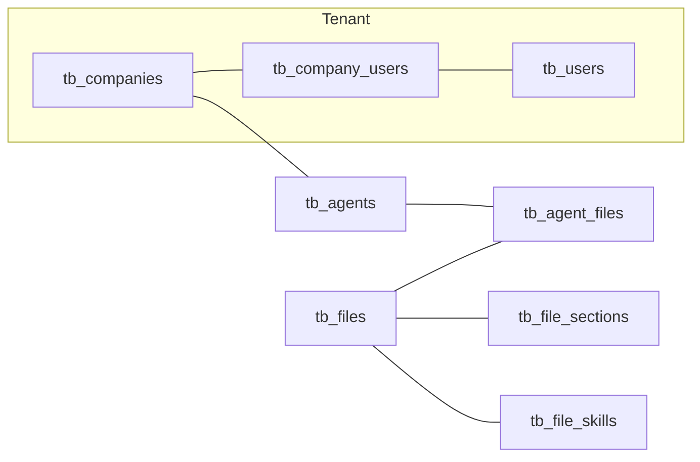

# Referência do schema Supabase (projeto Sonia)

**Propósito:** este arquivo é a **fonte de verdade** no repositório para descrever como o banco **`public`** está modelado no ambiente atual e como ele se conecta ao código (FrontEnd, BackEnd e RPCs).

No Cursor há regra de projeto em `.cursor/rules/supabase-schema-source.mdc` que aponta para este arquivo sempre que migrations forem trabalhadas.

**Para quem trabalha no Cursor / assistentes:** antes de propor, revisar ou explicar **qualquer migration SQL**, leia este documento e alinhe com ele. Depois que uma migration for aplicada em produção/staging, **atualize a seção "Histórico de verificação"** e qualquer trecho que tenha mudado.

**Última consolidação:** 2026-05-06 — inventário + **extensão mesmo dia:** CHECK em `tb_files`, listagem completa `pg_policies`, flags RLS por tabela, confirmação de **zero triggers** em `tb_files` / `tb_file_sections` / `tb_file_skills`.

---

## 1. Visão geral da arquitetura de dados

- **Multi-tenant por empresa:** `tb_companies` é o núcleo. Usuários ligam-se a empresas via `tb_company_users` (`user_id`, `companies_id`, `role`, `status`, …).
- **Autenticação / usuários app:** `tb_users` (inclui `email` único); muitos fluxos usam **email** como chave nas RPCs `sp_*` (não apenas `auth.uid()`).
- **Agentes:** `tb_agents` (campo `nome`, `companies_id`, LLM config, CRM, templates, etc.).
- **Base de conhecimento (Knowledge Base):** metadados de arquivo em `tb_files`; vetores/chunks em `tb_file_sections`; skills extraídas em `tb_file_skills`; vínculo agente↔arquivo em `tb_agent_files`.
- **Integrações:** `tb_integrations` (WhatsApp, e-mail, etc.), com tabelas satélites (templates, mensagens, campanhas, feature flags…).
- **CRM:** `tb_crms`, `tb_crm_integrations`, eventos e mapeamentos.
- **Cobrança / plano:** `tb_subscriptions` (Stripe, `plan`, `status`, …). **Atendimentos (sessões):** `tb_service_sessions`. **Notificações in-app:** `tb_notifications`.
- **Traduções UI:** `tb_i18n_translations` (global por `companies_id IS NULL` ou por empresa).



---

## 2. Inventário de tabelas (`public`)

**BASE TABLE**

| table_name |
|------------|
| kv_store_eeb342a4 |
| tb_activity_history |
| tb_agent_decisions |
| tb_agent_files |
| tb_agent_token_usage |
| tb_agent_voice_profiles |
| tb_agents |
| tb_agents_template_channels |
| tb_agents_template_skills |
| tb_agents_templates |
| tb_api_keys |
| tb_channels |
| tb_companies |
| tb_company_users |
| tb_crm_event_mappings |
| tb_crm_events |
| tb_crm_integrations |
| tb_crms |
| tb_email_integration_settings |
| tb_events_canonical |
| tb_feedback |
| tb_file_sections |
| tb_file_skills |
| tb_file_usage |
| tb_files |
| tb_flows |
| tb_governance_configs |
| tb_i18n_translations |
| tb_integrations |
| tb_llm_pricing |
| tb_permissions |
| tb_notifications |
| tb_service_sessions |
| tb_skills |
| tb_subscriptions |
| tb_system_events |
| tb_system_logs |
| tb_usage_metrics |
| tb_user_permissions |
| tb_users |
| tb_whatsapp_call_sessions |
| tb_whatsapp_campaign_jobs |
| tb_whatsapp_campaigns |
| tb_whatsapp_contacts |
| tb_whatsapp_integration_feature_flags |
| tb_whatsapp_message_events |
| tb_whatsapp_messages |
| tb_whatsapp_pricing_schedule |
| tb_whatsapp_templates |

**VIEW**

| view_name |
|-----------|
| vw_agents_templates_full |
| vw_skills |

---

## 3. Knowledge Base: `tb_files` e relacionadas

### 3.1 `tb_files` (colunas relevantes ao app — 2026-05-06)

| Coluna | Tipo (resumo) | Observação |
|--------|---------------|------------|
| id | uuid PK | |
| companies_id | uuid NOT NULL | Resolução típica: primeira empresa do usuário (`tb_company_users`). **No inventário de FKs não apareceu FK nomeada para `tb_companies`**, mas semanticamente é o tenant. |
| uploader_id | uuid NOT NULL | Preenchido pela `sp_create_file` atual (lookup por email → `tb_users`). |
| bucket | text NOT NULL | Ex.: `sonia-kb` |
| path | text NOT NULL | Caminho único no storage por empresa (`uq_company_file` em `companies_id, path`). |
| original_name | text NOT NULL | Nome amigável. |
| mime_type | text | |
| size_bytes | bigint | Cota / estatísticas. |
| is_system | boolean | Default `false`. |
| is_deleted | boolean | Default `false`. Soft delete / restauração via API. |
| created_at | timestamptz NOT NULL | Default `now()`. |
| file_purpose | text NOT NULL | Default `'rag'`. Valores permitidos no **CHECK** nomeado (`tb_files_file_purpose_check`): apenas `'rag'` e `'skills'`. |

### 3.2 Constraints CHECK em `tb_files` (verificado no Supabase)

| conname | definição |
|---------|-----------|
| `tb_files_file_purpose_check` | `CHECK ((file_purpose = ANY (ARRAY['rag'::text, 'skills'::text])))` |

Ou seja: qualquer insert/update direto fora desses dois literais falha no banco (alinha com a sanitização dentro de `sp_create_file`).

### 3.3 Triggers (`information_schema.triggers`)

Para **`tb_files`**, **`tb_file_sections`** e **`tb_file_skills`** em `public`: **nenhuma linha** — não há triggers declarados nessas três tabelas (consulta no apêndice D; resultado: sucesso sem linhas).

### 3.4 `tb_file_sections`

Chunks para **RAG** + embedding `vector` (índice HNSW `vector_cosine_ops`). FK: `file_id → tb_files`, `companies_id → tb_companies`.

### 3.5 `tb_file_skills`

Skills extraídas por arquivo. FK: `file_id → tb_files`, `companies_id → tb_companies`. Unicidade lógica: `(file_id, skill_name)`.

### 3.6 `tb_agent_files`

Associação N:N agente ↔ arquivo. PK composta `(agent_id, file_id)`. FK `file_id → tb_files`.

**Regra de produto (código BackEnd):** consulta RAG (`consultarArquivos`) deve considerar apenas arquivos com `file_purpose` RAG; skills (`getAgentSkills`) apenas arquivos com `file_purpose` skills — para não misturar mesmo com o mesmo vínculo em `tb_agent_files`.

**RLS:** `tb_files`, `tb_file_sections`, `tb_file_skills` e `tb_agent_files` aparecem com **`relrowsecurity = false`** no snapshot atual (§6.1). O controlo de acesso costuma estar nas RPCs `SECURITY DEFINER` / backend, não em políticas nessas tabelas.

---

## 4. RPCs e funções críticas (Knowledge Base + arquivos)

Estas assinaturas refletem o inventário **2026-05-06**. Se `CREATE OR REPLACE` mudar retorno/argumentos, atualize esta seção.

| Função | Argumentos (resumo) | Retorno | Uso |
|--------|---------------------|---------|-----|
| `sp_create_file` | `p_email, p_bucket, p_path, p_original_name, p_mime_type, p_size_bytes, p_file_purpose` | `uuid` | Após upload no Storage; grava `uploader_id` e `file_purpose`. |
| `sp_list_files_by_email` | `p_email` | tabela com `id, original_name, size_bytes, mime_type, is_deleted, created_at, **file_purpose**` | Lista na UI Knowledge Base. |
| `sp_get_file_usage_stats_by_email` | `p_email` | `json` | Cota / uso. |
| `sp_get_agent_files` | `p_email, p_agent_id` | tabela **sem** `file_purpose` no inventário | Arquivos vinculados ao agente; UI pode rotular RAG/Skills se estender RPC ou mapear por outra fonte. |
| `sp_replace_agent_files` | `p_email, p_agent_id, p_file_ids` | `jsonb` | Salvar seleção de arquivos do agente. |
| `sp_delete_file` / `sp_update_file_config` / `sp_list_deleted_files_for_cleanup` / `sp_permanently_delete_files` | (ver DB) | | Ciclo de vida / admin. |

Há dezenas de outras `sp_*` e `fn_*` (agentes, analytics, equipe, integrações) listadas no inventário; não duplicamos todas aqui — ao mexer em um domínio, complemente esta lista.

---

## 5. Migrations no repositório (o que costumam tocar)

| Arquivo | Escopo principal |
|---------|------------------|
| `BackEnd/database/migrations/MIGRATION_KB_FILES_QUOTA_AND_CREATE_FILE.sql` | `tb_files` (colunas), `sp_get_file_usage_stats_by_email`, `sp_create_file`, `sp_list_files_by_email`, `GRANTs`, `UPDATE` em `tb_i18n_translations` (`knowledgeBase.quota.info`). |
| `BackEnd/database/migrations/MIGRATION_TB_FILES_UPLOADER_FILE_PURPOSE_AND_LIST.sql` | Correção incremental `file_purpose` + `sp_create_file` + `sp_list_files_by_email` (útil se o KB completo já tiver sido rodado sem listagem). |

**Regra:** novas migrations de KB devem ser **compatíveis** com as colunas e RPCs descritas nas seções 3–4, ou este documento deve ser atualizado no mesmo PR.

---

## 6. RLS e segurança

### 6.1 `public`: RLS ligado ou não (`pg_class.relrowsecurity`)

| table_name | rls_on | rls_forced |
|------------|--------|------------|
| kv_store_eeb342a4 | true | false |
| tb_agent_decisions | true | false |
| tb_agent_voice_profiles | true | false |
| tb_agents | true | false |
| tb_agents_templates | true | false |
| tb_flows | true | false |
| tb_governance_configs | true | false |
| tb_subscriptions | true | false |
| tb_whatsapp_call_sessions | true | false |
| tb_activity_history | false | false |
| tb_agent_files | false | false |
| tb_agent_token_usage | false | false |
| tb_agents_template_channels | false | false |
| tb_agents_template_skills | false | false |
| tb_api_keys | false | false |
| tb_channels | false | false |
| tb_companies | false | false |
| tb_company_users | false | false |
| tb_crm_event_mappings | false | false |
| tb_crm_events | false | false |
| tb_crm_integrations | false | false |
| tb_crms | false | false |
| tb_email_integration_settings | false | false |
| tb_events_canonical | false | false |
| tb_feedback | false | false |
| tb_file_sections | false | false |
| tb_file_skills | false | false |
| tb_file_usage | false | false |
| tb_files | false | false |
| tb_i18n_translations | false | false |
| tb_integrations | false | false |
| tb_llm_pricing | false | false |
| tb_permissions | false | false |
| tb_skills | false | false |
| tb_system_events | false | false |
| tb_system_logs | false | false |
| tb_usage_metrics | false | false |
| tb_user_permissions | false | false |
| tb_users | false | false |
| tb_whatsapp_campaign_jobs | false | false |
| tb_whatsapp_campaigns | false | false |
| tb_whatsapp_contacts | false | false |
| tb_whatsapp_integration_feature_flags | false | false |
| tb_whatsapp_message_events | false | false |
| tb_whatsapp_messages | false | false |
| tb_whatsapp_pricing_schedule | false | false |
| tb_whatsapp_templates | false | false |

**Nota KB:** `tb_files`, `tb_file_sections`, `tb_file_skills`, `tb_agent_files` estão com **RLS desligado** no snapshot; o desenho atual depende de RPCs `SECURITY DEFINER` (ex.: `sp_create_file`, `sp_list_files_by_email`) e/ou backend com papel adequado.

**Nota:** `kv_store_eeb342a4` e `tb_whatsapp_call_sessions` têm `rls_on = true` neste inventário de flags, mas **não** apareceram políticas correspondentes na exportação `pg_policies` abaixo. Vale confirmar no Supabase Dashboard (ou repetir `pg_policies`) se há políticas noutro `schema` ou se a lista precisa atualização.

### 6.2 Políticas RLS em `public` (`pg_policies`)

| tablename | policyname | cmd | roles |
|-----------|------------|-----|-------|
| tb_agent_decisions | agent_decisions_insert_authenticated | INSERT | `{public}` |
| tb_agent_decisions | agent_decisions_select_same_company | SELECT | `{public}` |
| tb_agent_decisions | agent_decisions_update_admin_only | UPDATE | `{public}` |
| tb_agent_voice_profiles | tb_agent_voice_profiles_company_access | ALL | `{authenticated}` |
| tb_agents | agents_delete_admin_only | DELETE | `{public}` |
| tb_agents | agents_insert_admin_only | INSERT | `{public}` |
| tb_agents | agents_select_same_company | SELECT | `{public}` |
| tb_agents | agents_update_admin_only | UPDATE | `{public}` |
| tb_agents_templates | agents_templates_delete_admin_only | DELETE | `{public}` |
| tb_agents_templates | agents_templates_insert_admin_only | INSERT | `{public}` |
| tb_agents_templates | agents_templates_select_same_company | SELECT | `{public}` |
| tb_agents_templates | agents_templates_update_admin_only | UPDATE | `{public}` |
| tb_flows | flows_delete_admin_only | DELETE | `{public}` |
| tb_flows | flows_insert_admin_only | INSERT | `{public}` |
| tb_flows | flows_select_same_company | SELECT | `{public}` |
| tb_flows | flows_update_admin_only | UPDATE | `{public}` |
| tb_governance_configs | governance_configs_insert_admin_only | INSERT | `{public}` |
| tb_governance_configs | governance_configs_select_same_company | SELECT | `{public}` |
| tb_governance_configs | governance_configs_update_admin_only | UPDATE | `{public}` |
| tb_subscriptions | subscriptions_insert_system | INSERT | `{public}` |
| tb_subscriptions | subscriptions_select_same_company | SELECT | `{public}` |
| tb_subscriptions | subscriptions_update_admin_only | UPDATE | `{public}` |

### 6.3 Expressões `qual` e `with_check` (referência rápida)

- **tb_agent_decisions · agent_decisions_insert_authenticated** — `qual`: null · `with_check`: `(user_belongs_to_company(companies_id) = true)`
- **tb_agent_decisions · agent_decisions_select_same_company** — `qual`: `(user_belongs_to_company(companies_id) = true)` · `with_check`: null
- **tb_agent_decisions · agent_decisions_update_admin_only** — `qual` e `with_check`: `(is_user_admin(companies_id) = true)`
- **tb_agent_voice_profiles · tb_agent_voice_profiles_company_access** — `qual` e `with_check`: `EXISTS (SELECT 1 FROM tb_agents a JOIN tb_company_users cu ON cu.companies_id = a.companies_id WHERE a.id = tb_agent_voice_profiles.agent_id AND cu.user_id = auth.uid())`
- **tb_agents** — INSERT `with_check`: `(is_user_admin(companies_id) = true)` · SELECT `qual`: `(user_belongs_to_company(companies_id) = true)` · UPDATE/DELETE: `is_user_admin(companies_id) = true`
- **tb_agents_templates / tb_flows / tb_governance_configs** — mesmo padrão: SELECT com `user_belongs_to_company`; mutações com `is_user_admin`
- **tb_subscriptions · subscriptions_insert_system** — `with_check`: `(is_user_admin(companies_id) = true OR (current_setting('request.jwt.claims', true)::json ->> 'role') = 'service_role')`
- **tb_subscriptions · subscriptions_select_same_company** — `qual`: `(user_belongs_to_company(companies_id) = true)`
- **tb_subscriptions · subscriptions_update_admin_only** — `qual` e `with_check`: `(is_user_admin(companies_id) = true)`

Muitas operações (incluindo KB em tabelas sem RLS) passam por RPCs **`SECURITY DEFINER`** com validação por email/empresa no corpo da função.

---

## 7. Observações e débitos conhecidos

- **`kv_store_eeb342a4`:** muitos índices duplicados em `key` (`key_idx`, `key_idx1`, …) — provável repetição de migration; candidato a limpeza manual com `DROP INDEX` (fora do escopo automático). RLS está `true` na §6.1, mas a exportação `pg_policies` usada na §6.2 **não listou** políticas para esta tabela — revisar no Dashboard se políticas existem ou se o acesso depende só de service role.
- **`tb_whatsapp_call_sessions`:** RLS `true` na §6.1 sem linhas na mesma exportação `pg_policies` — revisar no Dashboard.
- **`tb_company_users`:** `ordinal_position` sem coluna `2` no inventário — coluna removida no passado.
- **`sp_get_agent_files`:** considerar evolução futura para retornar `file_purpose` alinhado à UI de configuração do agente.

---

## 8. Histórico de verificação

| Data | Ambiente | O que foi verificado |
|------|----------|----------------------|
| 2026-05-06 | Supabase (inventário colado no chat) | Lista de tabelas, colunas `public`, FKs, índices, funções `sp_*`/`fn_*` relevantes; amostra `tb_files` com `file_purpose` e `uploader_id`. |
| 2026-05-06 | Supabase (export complementar) | CHECK `tb_files_file_purpose_check`; políticas completas `pg_policies` (§6.2); flags RLS por tabela (§6.1); triggers KB: **nenhum** em `tb_files`, `tb_file_sections`, `tb_file_skills` (apêndice D). |

---

## Apêndice A — SQL read-only rápido (amostras)

```sql
-- Amostra recente tb_files + finalidade
SELECT id, original_name, file_purpose, uploader_id IS NOT NULL AS has_uploader,
       size_bytes, is_deleted, created_at
FROM public.tb_files
ORDER BY created_at DESC
LIMIT 20;
```

---

## Apêndice B — Atualizar este documento (export completo revisão)

Rodar quando quiser **atualizar** as seções 2–4 e políticas:

1. Lista de tabelas (`information_schema.tables` onde `schema = public`).
2. Colunas (`information_schema.columns` filtradas a `BASE TABLE`).
3. FKs + PK (`table_constraints` + `key_column_usage`).
4. `pg_policies` para `schemaname = 'public'`.
5. Funções: `SELECT proname, pg_get_function_identity_arguments(oid), pg_get_function_result(oid)` em `pg_proc` + `public`.

(O script completo em blocos separados já foi enviado na conversa; pode reaplicá-lo trimestralmente ou após toda migration significativa.)

---

## Apêndice C — CHECK constraints em `tb_files` (registro atual)

Resultado documentado na §3.2. Repetir com:

```sql
SELECT c.conname, pg_get_constraintdef(c.oid)
FROM pg_constraint c
JOIN pg_class r ON r.oid = c.conrelid
JOIN pg_namespace n ON n.oid = r.relnamespace
WHERE n.nspname = 'public'
  AND r.relname = 'tb_files'
  AND c.contype = 'c';
```

---

## Apêndice D — Triggers nas tabelas de Knowledge Base

```sql
SELECT event_object_table, trigger_name, event_manipulation, action_statement
FROM information_schema.triggers
WHERE trigger_schema = 'public'
  AND event_object_table IN ('tb_files', 'tb_file_sections', 'tb_file_skills')
ORDER BY event_object_table, trigger_name;
```

**Resultado atual:** nenhuma linha (sem triggers nessas tabelas).

---