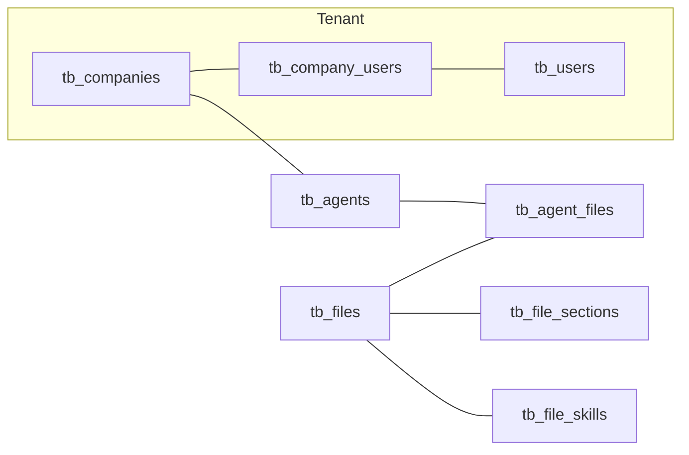
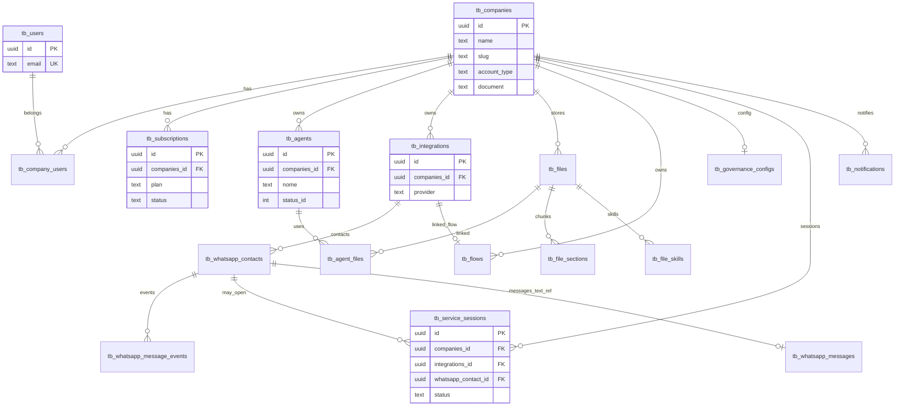

# Referência do schema Supabase (projeto Sonia)

**Propósito:** este arquivo é a **fonte de verdade** no repositório para descrever como o banco **`public`** está modelado no ambiente atual e como ele se conecta ao código (FrontEnd, BackEnd e RPCs).

No Cursor há regra de projeto em `.cursor/rules/supabase-schema-source.mdc` que aponta para este arquivo sempre que migrations forem trabalhadas.

**Para quem trabalha no Cursor / assistentes:** antes de propor, revisar ou explicar **qualquer migration SQL**, leia este documento e alinhe com ele. Depois que uma migration for aplicada em produção/staging, **atualize a seção "Histórico de verificação"** e qualquer trecho que tenha mudado.

**Última consolidação:** 2026-05-27 — inventário Supabase completo (blocos 1–10). **48** tabelas base + **2** views; **57** rotinas catalogadas em `public` (`sp_*`, `fn_*`, função do trigger; `sp_create_user` com 2 sobrecargas). Script: [`SUPABASE_INVENTARIO_READ_ONLY.sql`](SUPABASE_INVENTARIO_READ_ONLY.sql).

---

## 1. Visão geral da arquitetura de dados

- **Multi-tenant por empresa:** `tb_companies` é o núcleo. Usuários ligam-se a empresas via `tb_company_users` (`user_id`, `companies_id`, `role`, `status`, …).
- **Autenticação / usuários app:** `tb_users` (inclui `email` único); muitos fluxos usam **email** como chave nas RPCs `sp_*` (não apenas `auth.uid()`).
- **Agentes:** `tb_agents` (campo `nome`, `companies_id`, LLM config, CRM, templates, etc.).
- **Base de conhecimento (Knowledge Base):** metadados de arquivo em `tb_files`; vetores/chunks em `tb_file_sections`; skills extraídas em `tb_file_skills`; vínculo agente↔arquivo em `tb_agent_files`.
- **Integrações:** `tb_integrations` (WhatsApp, e-mail, etc.), com tabelas satélites (templates, mensagens, campanhas, feature flags…).
- **CRM:** `tb_crms`, `tb_crm_integrations`, eventos e mapeamentos.
- **Cobrança / plano:** `tb_subscriptions` (Stripe, `plan`, `status`, …). Coluna `plan`: `free` (padrão sem pagamento) + `rec_*` / `com_*` (CHECK em `MIGRATION_TB_SUBSCRIPTIONS_PLAN_IDS.sql` + `MIGRATION_FREE_PLAN_DEFAULT.sql`). Contas novas: trigger `trg_tb_companies_ensure_free_subscription` insere `free`/`inactive` se não houver linha. **Atendimentos (sessões):** `tb_service_sessions` — encerramento por inatividade: env `ATENDIMENTO_INACTIVITY_MINUTES` (padrão **1** min) ou legado `ATENDIMENTO_INACTIVITY_HOURS`. **Notificações in-app:** `tb_notifications`.
- **Traduções UI:** `tb_i18n_translations` (global por `companies_id IS NULL` ou por empresa).



### 1.1 Diagrama entidade-relacionamento (núcleo)

Visão simplificada das relações mais usadas pelo app. FKs adicionais podem existir — confirme com o inventário SQL.



---

## 2. Inventário de tabelas (`public`)

**BASE TABLE**

| table_name |
|------------|
| kv_store_eeb342a4 |
| tb_activity_history |
| tb_agent_decisions |
| tb_agent_files |
| tb_agent_token_usage |
| tb_agent_voice_profiles |
| tb_agents |
| tb_agents_template_channels |
| tb_agents_template_skills |
| tb_agents_templates |
| tb_api_keys |
| tb_channels |
| tb_companies |
| tb_company_users |
| tb_crm_event_mappings |
| tb_crm_events |
| tb_crm_integrations |
| tb_crms |
| tb_email_integration_settings |
| tb_events_canonical |
| tb_feedback |
| tb_file_sections |
| tb_file_skills |
| tb_file_usage |
| tb_files |
| tb_flow_mock_appointments |
| tb_flows |
| tb_governance_configs |
| tb_i18n_translations |
| tb_integrations |
| tb_llm_pricing |
| tb_permissions |
| tb_notifications |
| tb_service_sessions |
| tb_skills |
| tb_subscriptions |
| tb_system_events |
| tb_system_logs |
| tb_usage_metrics |
| tb_user_permissions |
| tb_users |
| tb_whatsapp_call_sessions |
| tb_whatsapp_campaign_jobs |
| tb_whatsapp_campaigns |
| tb_whatsapp_contacts |
| tb_whatsapp_integration_feature_flags |
| tb_whatsapp_message_events |
| tb_whatsapp_messages |
| tb_whatsapp_pricing_schedule |
| tb_whatsapp_templates |

**VIEW**

| view_name |
|-----------|
| vw_agents_templates_full |
| vw_skills |

### 2.1 Mapa por domínio

| Domínio | Tabelas | Responsabilidade |
|---------|---------|------------------|
| **Tenant / IAM** | `tb_companies`, `tb_users`, `tb_company_users`, `tb_permissions`, `tb_user_permissions` | Multi-tenant, papéis, vínculo usuário↔empresa |
| **Agentes** | `tb_agents`, `tb_agents_templates`, `tb_agents_template_*`, `tb_agent_decisions`, `tb_agent_token_usage`, `tb_agent_voice_profiles`, `tb_skills` | Configuração LLM, templates, decisões, voz |
| **Knowledge Base** | `tb_files`, `tb_file_sections`, `tb_file_skills`, `tb_agent_files`, `tb_file_usage` | RAG, skills, storage `sonia-kb`, cota |
| **WhatsApp** | `tb_integrations`, `tb_whatsapp_*`, `tb_whatsapp_call_sessions` | Meta Cloud API, inbox, campanhas, templates |
| **Atendimento** | `tb_service_sessions`, `tb_notifications` | Sessões faturáveis, alertas (ex.: limite de plano) |
| **CRM** | `tb_crms`, `tb_crm_integrations`, `tb_crm_events`, `tb_crm_event_mappings` | HubSpot, Mailchimp, eventos |
| **Billing** | `tb_subscriptions`, `tb_usage_metrics` | Stripe, planos (`free`, `rec_*`, `com_*`) |
| **Flows** | `tb_flows`, `tb_flow_mock_appointments` | Automações visuais; mock de agendamento para testes de fluxo |
| **Governança** | `tb_governance_configs` | AI Guardrails (planos Enterprise) |
| **Analytics / KPIs** | `tb_activity_history`, `tb_agent_token_usage`, `tb_llm_pricing` | Insights, custos, histórico |
| **Canais / e-mail** | `tb_channels`, `tb_email_integration_settings` | Outros canais e SMTP/OAuth |
| **Sistema** | `tb_system_events`, `tb_system_logs`, `tb_feedback`, `tb_api_keys`, `tb_events_canonical` | Logs, feedback, chaves legadas |
| **i18n** | `tb_i18n_translations` | Traduções da UI (global ou por empresa) |
| **Legado / KV** | `kv_store_eeb342a4` | Store key-value (legado Edge) |
| **Views** | `vw_agents_templates_full`, `vw_skills` | Leitura agregada |

### 2.2 Achados do inventário em produção (2026-05-27)

Comparado ao snapshot de 2026-05-06 (export blocos 1–4):

| Item | Detalhe |
|------|---------|
| **Nova tabela** | `tb_flow_mock_appointments` — slots/agendamentos simulados para nós de fluxo (appointment). |
| **`tb_subscriptions`** | Colunas: `stripe_customer_id`, `stripe_subscription_id`, `plan` (default `free`), `status` (default `inactive`), `current_period_*`, `canceled_at`. CHECK `plan` inclui `free`, `rec_*`, `com_*`. CHECK `status`: `active`, `inactive`, `canceled`, `past_due`, `trialing`. |
| **`tb_integrations`** | `automation_mode` (default `agent`), `linked_flow_id` → FK `tb_flows`. |
| **`tb_whatsapp_messages`** | `whatsapp_contact_id` é **`text`** (não `uuid`); **não há FK** declarada no catálogo para `tb_whatsapp_contacts`. `metadata` jsonb. |
| **`tb_service_sessions`** | FK confirmada: `whatsapp_contact_id` → `tb_whatsapp_contacts.id` (**uuid**). |
| **`tb_files`** | `companies_id` e `uploader_id` NOT NULL; **sem FK nomeada** para `tb_companies` no inventário pg (tenant por convenção + RPCs). |
| **`tb_agent_files`** | PK composta `(agent_id, file_id)`; FK só em `file_id` → `tb_files`. |
| **`tb_agents`** | `extra_features` (text); `integrations_id` opcional; FK `companies_id`, `crm_integration_id`, `role_template_id`. |
| **`tb_flows`** | `nodes` jsonb, `user_email`, `status_id`, `companies_id`; sem FK `companies_id` no export (tenant por `user_email` / app). |

**Inventário:** blocos 1–10 aplicados (colunas, FKs, CHECK, índices, RLS, políticas, triggers, funções, contagens).

### 2.3 `tb_subscriptions` (billing)

| Coluna | Tipo | Default / CHECK |
|--------|------|-----------------|
| `companies_id` | uuid NOT NULL | FK → `tb_companies` |
| `stripe_customer_id`, `stripe_subscription_id` | text NOT NULL | Stripe |
| `plan` | text NOT NULL | `free` (default); CHECK: `free`, `rec_start`, `rec_growth`, `rec_enterprise`, `com_start`, `com_growth`, `com_enterprise` |
| `status` | text NOT NULL | `inactive` (default); CHECK: `active`, `inactive`, `canceled`, `past_due`, `trialing` |
| `current_period_start`, `current_period_end`, `canceled_at` | timestamptz | Ciclo Stripe |

### 2.4 `tb_flow_mock_appointments`

Tabela de suporte a fluxos com agendamento simulado (dev/demo). PK: `appointment_id` (uuid). Campos: `provider_key`, `status`, `slot_id`, `starts_at`/`ends_at`, `specialty`, `doctor_name`, `patient_*`, `mode` (`presencial` \| `online`), CHECK em `status` e `mode`.

### 2.5 CHECK constraints relevantes (amostra)

Além de `tb_files_file_purpose_check` (§3.2), o banco define:

| Tabela | Constraint | Valores |
|--------|------------|---------|
| `tb_subscriptions` | `tb_subscriptions_plan_check` | `free`, `rec_*`, `com_*` |
| `tb_subscriptions` | `tb_subscriptions_status_check` | `active`, `inactive`, `canceled`, `past_due`, `trialing` |
| `tb_service_sessions` | `tb_service_sessions_status_check` | `open`, `closed` |
| `tb_service_sessions` | `tb_service_sessions_end_reason_check` | `flow_completed`, `inactivity`, `restart`, `manual` |
| `tb_whatsapp_messages` | `tb_whatsapp_messages_direction_check` | `inbound`, `outbound` |
| `tb_agent_decisions` | `tb_agent_decisions_status_check` | `pending_approval`, `approved`, `rejected`, `auto_sent` |
| `tb_integrations` | (sem CHECK nomeado no export) | `automation_mode` default `agent` |

Lista completa: reexecutar bloco 4 do inventário SQL.

### 2.6 Índices destacados (export bloco 5, 2026-05-27)

Não listamos os ~200 índices aqui; os mais relevantes para o app e integridade:

| Tabela | Índice | Uso |
|--------|--------|-----|
| `tb_file_sections` | `tb_file_sections_embedding_idx` (HNSW, `vector_cosine_ops`) | Busca vetorial RAG |
| `tb_files` | `uq_company_file` (`companies_id`, `path`) | Um path por empresa |
| `tb_subscriptions` | `unique_company_subscription` (`companies_id`) | Uma assinatura por empresa |
| `tb_subscriptions` | `unique_stripe_subscription`, `idx_subscriptions_stripe_*` | Webhook Stripe |
| `tb_subscriptions` | `idx_subscriptions_status` (WHERE `status = 'active'`) | Filtro plano ativo |
| `tb_service_sessions` | `uq_tb_service_sessions_one_open_per_contact` (WHERE `status = 'open'`) | Uma sessão aberta por contato+integração |
| `tb_service_sessions` | `idx_tb_service_sessions_company_month` | Billing mensal |
| `tb_integrations` | `idx_tb_integrations_automation_mode`, `idx_tb_integrations_linked_flow_id` | Modo agente vs fluxo |
| `tb_flow_mock_appointments` | `idx_tb_flow_mock_appointments_provider_status` | Mock agendamento |
| `tb_governance_configs` | `tb_governance_configs_companies_id_key` | Uma config por empresa |
| `tb_agent_voice_profiles` | `idx_tb_agent_voice_profiles_agent_id` (UNIQUE) | Um perfil de voz por agente |
| `tb_api_keys` | `uq_api_keys_company_provider` | Uma chave por provider/empresa |
| `tb_whatsapp_messages` | `idx_whatsapp_messages_metadata` (GIN) | Filtros em `metadata` |
| `tb_whatsapp_messages` | `idx_whatsapp_phone_number`, `idx_whatsapp_phone_unread` | Inbox |
| `tb_whatsapp_templates` | `uq_whatsapp_templates_integration_name_lang` | Template por integração+nome+idioma |
| `tb_usage_metrics` | `tb_usage_metrics_companies_id_month_start_key` | Métricas mensais por empresa |
| `tb_events_canonical` | `idx_events_canonical_type_entity` (UNIQUE) | Idempotência de eventos |
| `tb_crm_events` | `unique_external_event`, `idx_crm_events_processed` | Fila CRM |

---

## 3. Knowledge Base: `tb_files` e relacionadas

### 3.1 `tb_files` (colunas relevantes ao app — 2026-05-06)

| Coluna | Tipo (resumo) | Observação |
|--------|---------------|------------|
| id | uuid PK | |
| companies_id | uuid NOT NULL | Resolução típica: primeira empresa do usuário (`tb_company_users`). **No inventário de FKs não apareceu FK nomeada para `tb_companies`**, mas semanticamente é o tenant. |
| uploader_id | uuid NOT NULL | Preenchido pela `sp_create_file` atual (lookup por email → `tb_users`). |
| bucket | text NOT NULL | Ex.: `sonia-kb` |
| path | text NOT NULL | Caminho único no storage por empresa (`uq_company_file` em `companies_id, path`). |
| original_name | text NOT NULL | Nome amigável. |
| mime_type | text | |
| size_bytes | bigint | Cota / estatísticas. |
| is_system | boolean | Default `false`. |
| is_deleted | boolean | Default `false`. Soft delete / restauração via API. |
| created_at | timestamptz NOT NULL | Default `now()`. |
| file_purpose | text NOT NULL | Default `'rag'`. Valores permitidos no **CHECK** nomeado (`tb_files_file_purpose_check`): apenas `'rag'` e `'skills'`. |

### 3.2 Constraints CHECK em `tb_files` (verificado no Supabase)

| conname | definição |
|---------|-----------|
| `tb_files_file_purpose_check` | `CHECK ((file_purpose = ANY (ARRAY['rag'::text, 'skills'::text])))` |

Ou seja: qualquer insert/update direto fora desses dois literais falha no banco (alinha com a sanitização dentro de `sp_create_file`).

### 3.3 Triggers (`information_schema.triggers`)

Para **`tb_files`**, **`tb_file_sections`** e **`tb_file_skills`** em `public`: **nenhuma linha** — não há triggers declarados nessas três tabelas (consulta no apêndice D; resultado: sucesso sem linhas).

### 3.4 `tb_file_sections`

Chunks para **RAG** + embedding `vector` (índice HNSW `vector_cosine_ops`). FK: `file_id → tb_files`, `companies_id → tb_companies`.

### 3.5 `tb_file_skills`

Skills extraídas por arquivo. FK: `file_id → tb_files`, `companies_id → tb_companies`. Unicidade lógica: `(file_id, skill_name)`.

### 3.6 `tb_agent_files`

Associação N:N agente ↔ arquivo. PK composta `(agent_id, file_id)`. FK `file_id → tb_files`.

**Regra de produto (código BackEnd):** consulta RAG (`consultarArquivos`) deve considerar apenas arquivos com `file_purpose` RAG; skills (`getAgentSkills`) apenas arquivos com `file_purpose` skills — para não misturar mesmo com o mesmo vínculo em `tb_agent_files`.

**RLS (2026-05-27):** `tb_files`, `tb_file_sections`, `tb_file_skills` e `tb_agent_files` têm **RLS ligado** com políticas `tb_*_auth_*_company` para role `authenticated` (§6). O backend continua a usar RPCs `SECURITY DEFINER` para operações sensíveis (upload, listagem por email).

---

## 4. Funções e RPCs (`public`, bloco 9 — 2026-05-27)

Chave de resolução em quase todas as `sp_*`: **`p_email` / `p_user_email`** → `tb_users` → `tb_company_users` → `companies_id` (não depende só de `auth.uid()` no JWT).

| Segurança | Quantidade | Uso típico |
|-----------|------------|------------|
| **SECURITY DEFINER** | 34 | Validação por email + escrita controlada (KB, equipe, analytics, login, trigger free plan) |
| **SECURITY INVOKER** | 23 | Leituras/creates onde RLS ou validação no corpo basta |

**Sobrecarga:** `sp_create_user` existe em **duas** assinaturas (com e sem `p_last_name`).

### 4.1 Autenticação, usuário e empresa

| Função | Security | Retorno (resumo) |
|--------|----------|------------------|
| `sp_create_user` | INVOKER | `uuid` — `(name, email, password)` ou `(name, last_name, email, password)` |
| `sp_create_user_with_company` | DEFINER | `jsonb` |
| `sp_create_company_for_user` | DEFINER | `jsonb` |
| `sp_login_user` | DEFINER | `user_id, name, last_name` |
| `sp_change_password` | DEFINER | `json` |

Trigger (função PL/pgSQL): `trg_tb_companies_ensure_free_subscription` — **DEFINER**, `trigger` — pareado com INSERT em `tb_companies` (§6.4).

### 4.2 Agentes e templates

| Função | Security | Retorno (resumo) |
|--------|----------|------------------|
| `sp_create_agent_by_email` | DEFINER | `uuid` |
| `sp_list_agents_by_email` | DEFINER | lista agentes |
| `sp_get_agent_config_by_email` | INVOKER | provider, model, api_key, LLM |
| `sp_update_agent_llm_config_by_email` | INVOKER | `updated_id` |
| `sp_get_agents_playground_by_email` | INVOKER | agentes + `channels` jsonb |
| `fn_get_agents_with_api_key` | INVOKER | agentes com api_key (sensível) |
| `sp_agents_templates_full_by_email` | INVOKER | templates + skills + channels |
| `sp_create_agent_template` | DEFINER | `uuid` |

Funções de trigger: `fn_log_agent_updated`, `fn_log_flow_updated`, `fn_log_integration_updated` — **INVOKER**, `trigger`.

### 4.3 Knowledge Base (arquivos)

| Função | Security | Retorno (resumo) |
|--------|----------|------------------|
| `sp_create_file` | DEFINER | `uuid` — inclui `p_file_purpose` |
| `sp_list_files_by_email` | DEFINER | inclui **`file_purpose`** |
| `sp_get_file_usage_stats_by_email` | DEFINER | `json` (cota) |
| `sp_get_agent_files` | DEFINER | `file_id, original_name, …` — **sem** `file_purpose` no retorno |
| `sp_link_agent_files` / `sp_unlink_agent_files` / `sp_replace_agent_files` | DEFINER | `jsonb` |
| `sp_delete_file` / `sp_update_file_config` | DEFINER | ciclo de vida |
| `sp_list_deleted_files_for_cleanup` / `sp_permanently_delete_files` | DEFINER | limpeza Storage |

### 4.4 Analytics e cockpit

| Função | Security | Retorno (resumo) |
|--------|----------|------------------|
| `sp_get_analytics_company_id_by_email` | DEFINER | `uuid` |
| `sp_get_analytics_overview_by_email` | DEFINER | série diária |
| `sp_get_analytics_summary_by_email` | DEFINER | resumo KPIs |
| `sp_get_analytics_channel_distribution_by_email` | DEFINER | por canal |
| `sp_get_analytics_agent_performance_by_email` | DEFINER | por agente |
| `sp_get_analytics_rag_usage_by_email` | DEFINER | uso RAG + `top_files` jsonb |
| `sp_cockpit_metrics_by_email` | INVOKER | interações, leads, msg/min |
| `sp_activity_overview` | DEFINER | feed atividades |

Script repo: `BackEnd/database/procedures/SP_ANALYTICS_INSIGHTS.sql` (cuidado com `42P13` ao mudar tipo de retorno).

### 4.5 Equipe e permissões

| Função | Security | Retorno (resumo) |
|--------|----------|------------------|
| `sp_get_team_members_by_email` | DEFINER | membros + permissões |
| `sp_add_team_member_by_email` | DEFINER | `jsonb` |
| `sp_remove_team_member` | DEFINER | `jsonb` |
| `sp_update_team_member_permission` | DEFINER | `jsonb` |
| `sp_get_available_permissions` | DEFINER | catálogo `tb_permissions` |

### 4.6 Integrações, API keys, billing

| Função | Security | Retorno (resumo) |
|--------|----------|------------------|
| `sp_upsert_integration_by_email` | INVOKER | `tb_integrations` |
| `sp_get_integration_by_email` | INVOKER | dados integração |
| `fn_check_integration_expiration` | INVOKER | `void` (job/cron) |
| `sp_create_api_key_by_email` | INVOKER | `tb_api_keys` |
| `sp_get_api_keys_by_email` | INVOKER | lista chaves |
| `sp_get_subscription_usage_by_email` | DEFINER | uso vs limites do plano |

### 4.7 WhatsApp e decisões do agente

| Função | Security | Retorno (resumo) |
|--------|----------|------------------|
| `sp_list_unassigned_whatsapp_conversations` | INVOKER | inbox sem agente |
| `sp_count_unassigned_whatsapp_conversations` | INVOKER | `bigint` |
| `sp_count_pending_decisions_by_email` | INVOKER | aprovações pendentes |

### 4.8 Logs, fallbacks e atividade

| Função | Security | Retorno (resumo) |
|--------|----------|------------------|
| `sp_get_system_logs_by_email` | DEFINER | logs filtrados |
| `sp_count_system_logs_by_email` | DEFINER | contagem por impacto |
| `sp_get_fallbacks_by_email` / `sp_count_fallbacks_by_email` | DEFINER | eventos/fallbacks |
| `sp_save_activity_history` | DEFINER | `uuid` |

**Regra:** ao alterar assinatura no SQL, atualize esta seção e o histórico §8. Reexecutar bloco 9 do inventário para diff completo.

---

## 5. Migrations no repositório (o que costumam tocar)

| Arquivo | Escopo principal |
|---------|------------------|
| `BackEnd/database/migrations/MIGRATION_KB_FILES_QUOTA_AND_CREATE_FILE.sql` | `tb_files` (colunas), `sp_get_file_usage_stats_by_email`, `sp_create_file`, `sp_list_files_by_email`, `GRANTs`, `UPDATE` em `tb_i18n_translations` (`knowledgeBase.quota.info`). |
| `BackEnd/database/migrations/MIGRATION_TB_FILES_UPLOADER_FILE_PURPOSE_AND_LIST.sql` | Correção incremental `file_purpose` + `sp_create_file` + `sp_list_files_by_email` (útil se o KB completo já tiver sido rodado sem listagem). |

**Regra:** novas migrations de KB devem ser **compatíveis** com as colunas e RPCs descritas nas seções 3–4, ou este documento deve ser atualizado no mesmo PR.

---

## 6. RLS e segurança

### 6.1 `public`: RLS ligado (`pg_class.relrowsecurity`, bloco 6)

**Todas as 48 tabelas base** têm `rls_on = true` e `rls_forced = false` (incluindo KB, WhatsApp, CRM, `tb_flow_mock_appointments`).

O acesso direto via PostgREST/JWT `authenticated` é filtrado por políticas; webhooks e jobs usam **service role** (bypass RLS) ou RPCs `SECURITY DEFINER`.

### 6.2 Padrões de políticas (bloco 7)

Funções auxiliares recorrentes: `user_belongs_to_company(companies_id)`, `is_user_admin(companies_id)`, `auth.uid()`.

| Padrão | Role | Tabelas (exemplos) | Comportamento |
|--------|------|-------------------|---------------|
| **A — CRUD empresa** | `authenticated` | `tb_files`, `tb_integrations`, `tb_activity_history`, `tb_crm_integrations`, `tb_whatsapp_message_events`, … | Políticas `tb_*_auth_{select,insert,update,delete}_company` com `user_belongs_to_company(companies_id)` |
| **B — deny all** | `authenticated` | `kv_store_eeb342a4`, `tb_channels`, `tb_companies`, `tb_users`, `tb_crms`, `tb_whatsapp_contacts`, `tb_whatsapp_messages`, `tb_whatsapp_templates`, `tb_flow_mock_appointments`, `tb_llm_pricing`, … | `qual` / `with_check` = `false` — cliente JWT não acessa; só service role / RPC |
| **C — admin + empresa** | `public` | `tb_agents`, `tb_flows`, `tb_agents_templates`, `tb_governance_configs` | SELECT: `user_belongs_to_company`; INSERT/UPDATE/DELETE: `is_user_admin` |
| **D — admin / service** | `public` | `tb_subscriptions` | INSERT: admin **ou** JWT `role = service_role`; SELECT empresa; UPDATE admin |
| **E — join `tb_company_users`** | `authenticated` | `tb_notifications`, `tb_service_sessions` | `EXISTS (... cu.user_id = auth.uid())` |
| **F — agente via join** | `authenticated` | `tb_agent_voice_profiles` | EXISTS em `tb_agents` + `tb_company_users` |
| **G — i18n leitura** | `anon`, `authenticated` | `tb_i18n_translations` | Global: `companies_id IS NULL` e `is_active`; por empresa: membro ativo |

**Duplicidade:** várias tabelas têm políticas **C** (`public`) e **A** (`authenticated`) em paralelo — o PostgREST avalia políticas PERMISSIVE com OR.

**Tabelas só deny (`authenticated`):** inclui inbox WhatsApp (`tb_whatsapp_messages`), contatos, templates, pricing schedule, campanhas jobs, CRM events/mappings, email settings, permissions, skills, agent template channels/skills.

### 6.3 Expressões `qual` / `with_check` (referência)

- **Empresa:** `(user_belongs_to_company(companies_id) = true)`
- **Admin:** `(is_user_admin(companies_id) = true)`
- **Subscriptions INSERT:** admin **ou** `(current_setting('request.jwt.claims', true)::json ->> 'role') = 'service_role'` (Stripe webhook / trigger)
- **Notifications / service_sessions:** `EXISTS (SELECT 1 FROM tb_company_users cu WHERE cu.companies_id = <tabela>.companies_id AND cu.user_id = auth.uid())`
- **i18n global:** `(is_active = true) AND (companies_id IS NULL)` — roles `{anon, authenticated}`

Lista completa de `policyname`: reexecutar bloco 7 do inventário SQL.

### 6.4 Triggers (bloco 8, 2026-05-27)

| Tabela | Trigger | Evento | Notas |
|--------|---------|--------|-------|
| `tb_companies` | `trg_tb_companies_ensure_free_subscription` | INSERT AFTER | Cria `tb_subscriptions` `free`/`inactive` se ausente |
| `tb_companies` | `trigger_create_default_governance_config` | INSERT AFTER | Governance padrão |
| `tb_whatsapp_messages` | `trg_assign_agent_to_whatsapp_message` | INSERT BEFORE | Atribui agente |
| `tb_whatsapp_messages` | `trigger_clean_whatsapp_message_history` | INSERT BEFORE | Limpeza histórico |
| `tb_agents` | `trigger_log_agent_updated` | UPDATE AFTER | Auditoria |
| `tb_flows` | `trigger_log_flow_updated` | UPDATE AFTER | Auditoria |
| `tb_integrations` | `trigger_log_integration_updated` | UPDATE AFTER | Auditoria |
| Várias | `trigger_update_*_updated_at` | UPDATE BEFORE | `updated_at` automático |

**KB:** `tb_files`, `tb_file_sections`, `tb_file_skills` — **sem triggers** (confirmado; ver Apêndice D).

Operações sensíveis (upload KB, webhooks) continuam preferindo RPCs **`SECURITY DEFINER`** e service role no BackEnd.

---

## 7. Observações e débitos conhecidos

- **`tb_whatsapp_messages`:** RLS `deny_all` para `authenticated`; acesso via **service role** no BackEnd. `whatsapp_contact_id` é `text` (sem FK); índices em `whatsapp_contact_id` + GIN em `metadata`.
- **`tb_whatsapp_contacts` / templates / pricing:** também `deny_all` para JWT cliente — alinhado a não expor inbox direto no browser.
- **`kv_store_eeb342a4`:** política `kv_store_eeb342a4_auth_deny_all`; índice `key` + `key_idx` (`text_pattern_ops`).
- **`tb_company_users`:** `ordinal_position` sem coluna `2` no inventário — coluna removida no passado.
- **`sp_get_agent_files`:** considerar evolução futura para retornar `file_purpose` alinhado à UI de configuração do agente.
- **Snapshot 2026-05-06 vs 2026-05-27:** RLS passou de “muitas tabelas off” para **todas on**; políticas `tb_*_auth_*_company` cobrem KB e integrações.

---

## 8. Histórico de verificação

| Data | Ambiente | O que foi verificado |
|------|----------|----------------------|
| 2026-05-06 | Supabase (inventário colado no chat) | Lista de tabelas, colunas `public`, FKs, índices, funções `sp_*`/`fn_*` relevantes; amostra `tb_files` com `file_purpose` e `uploader_id`. |
| 2026-05-06 | Supabase (export complementar) | CHECK `tb_files_file_purpose_check`; políticas completas `pg_policies` (§6.2); flags RLS por tabela (§6.1); triggers KB: **nenhum** em `tb_files`, `tb_file_sections`, `tb_file_skills` (apêndice D). |
| 2026-05-27 | Código + `MIGRATION_TB_SUBSCRIPTIONS_PLAN_IDS.sql` | `tb_subscriptions.plan`: somente `rec_*` / `com_*`; removido legado `pro`/`plus`/`enterprise` do CHECK e do `normalizePlanId` no app. |
| 2026-05-27 | `MIGRATION_FREE_PLAN_DEFAULT.sql` + app | Plano `free` padrão; sem assinatura `active`/`trialing` → limites zerados no backend; UI mostra “Plano gratuito”. |
| 2026-05-27 | Doc README + inventário | Diagrama ER §1.1, mapa por domínio §2.1, script `SUPABASE_INVENTARIO_READ_ONLY.sql`. |
| 2026-05-27 | Export Supabase blocos 1–4 | Inventário 48 tabelas; `tb_flow_mock_appointments`; CHECK `tb_subscriptions` com `free`; FKs WhatsApp/sessões; §2.2–2.5. |
| 2026-05-27 | Export Supabase blocos 5–8 | §2.6 índices; §6 RLS 100% on; padrões políticas; triggers incl. `trg_tb_companies_ensure_free_subscription`. |
| 2026-05-27 | Export Supabase blocos 9–10 | §4 inventário completo `sp_*`/`fn_*`; Apêndice E contagens (staging/dev). |
| 2026-05-28 | Go-live MVP (staging/prod) | `MIGRATION_TB_SUBSCRIPTIONS_PLAN_IDS.sql` + `MIGRATION_FREE_PLAN_DEFAULT.sql` aplicadas via `supabase db query --linked` no projeto `rmfbkyntvkpettjtgaws`. Backfill `free_local_{companies_id}` em `stripe_*` para contas sem Stripe. Auditoria: `npm run go-live:audit`. |
| 2026-05-28 | Contas PF/PJ | `MIGRATION_ACCOUNT_TYPE_PF_PJ.sql` — `tb_companies.account_type` (`individual` \| `company`), `document` (CPF/CNPJ **obrigatório** no cadastro). RPCs: `SP_CREATE_USER_WITH_COMPANY.sql`, `SP_CREATE_COMPANY_FOR_USER.sql`. |

**Nota operacional:** `stripe_customer_id` / `stripe_subscription_id` NOT NULL + `unique_stripe_subscription` — contas `free` sem Stripe usam placeholders `free_local_{uuid}` (ver migration e `scripts/go-live/backfill-free-subscriptions.mjs`).

---

## Apêndice A — SQL read-only rápido (amostras)

```sql
-- Amostra recente tb_files + finalidade
SELECT id, original_name, file_purpose, uploader_id IS NOT NULL AS has_uploader,
       size_bytes, is_deleted, created_at
FROM public.tb_files
ORDER BY created_at DESC
LIMIT 20;
```

---

## Apêndice B — Inventário completo (recomendado)

Execute o arquivo consolidado (read-only):

**[`SUPABASE_INVENTARIO_READ_ONLY.sql`](SUPABASE_INVENTARIO_READ_ONLY.sql)**

Ele gera, em sequência: tabelas/views, colunas, PK/FK, CHECK, índices, RLS, políticas, triggers, funções `sp_*`/`fn_*` e contagens das tabelas críticas.

Última atualização manual: export completo 2026-05-27 (blocos 1–10).

---

## Apêndice C — CHECK constraints em `tb_files` (registro atual)

Resultado documentado na §3.2. Repetir com:

```sql
SELECT c.conname, pg_get_constraintdef(c.oid)
FROM pg_constraint c
JOIN pg_class r ON r.oid = c.conrelid
JOIN pg_namespace n ON n.oid = r.relnamespace
WHERE n.nspname = 'public'
  AND r.relname = 'tb_files'
  AND c.contype = 'c';
```

---

## Apêndice D — Triggers nas tabelas de Knowledge Base

```sql
SELECT event_object_table, trigger_name, event_manipulation, action_statement
FROM information_schema.triggers
WHERE trigger_schema = 'public'
  AND event_object_table IN ('tb_files', 'tb_file_sections', 'tb_file_skills')
ORDER BY event_object_table, trigger_name;
```

**Resultado atual:** nenhuma linha (sem triggers nessas tabelas).

---

## Apêndice E — Contagens amostrais (bloco 10, 2026-05-27)

Snapshot do ambiente exportado (não é produção com tráfego real). Útil para sanity check após migrations.

| table_name | row_count |
|------------|-----------|
| tb_users | 5 |
| tb_companies | 3 |
| tb_company_users | 4 |
| tb_subscriptions | 1 |
| tb_agents | 5 |
| tb_flows | 4 |
| tb_integrations | 2 |
| tb_files | 3 |
| tb_whatsapp_contacts | 7 |
| tb_whatsapp_messages | 15 |
| tb_service_sessions | 1500 |

`tb_service_sessions` concentra volume histórico de atendimentos; demais tabelas em escala de dev/staging.

---