# Plataforma de Atendimento Sonia

Plataforma multi-tenant da **Onsmart AI** para atendimento automatizado com agentes de IA: WhatsApp (Meta), inbox operacional, base de conhecimento (RAG), fluxos visuais, governança avançada e assinaturas comerciais (Stripe).

Este README é o **ponto de entrada técnico** para desenvolvedores e operações. Para documentação de produto (linguagem de negócio, PDF), veja [docs/plataforma-sonia-documentacao-tecnica.md](docs/plataforma-sonia-documentacao-tecnica.md).

---

## Sumário

- [Estrutura do repositório](#estrutura-do-repositório)
- [Arquitetura de software](#arquitetura-de-software)
- [Superfície da API](#superfície-da-api-backend)
- [Segurança e multi-tenant](#segurança-e-multi-tenant)
- [Modelagem de dados](#modelagem-de-dados)
- [Domínios do banco](#domínios-do-banco)
- [Fluxos principais](#fluxos-principais)
- [Stack e pré-requisitos](#stack-e-pré-requisitos)
- [Como rodar localmente](#como-rodar-localmente)
- [Deploy do backend](#deploy-do-backend)
- [Observabilidade](#observabilidade)
- [Documentação complementar](#documentação-complementar)
- [Manutenção da documentação](#manutenção-da-documentação)
- [Índice de diagramas Mermaid](#índice-de-diagramas-mermaid)

---

## Índice de diagramas Mermaid

| # | Tipo | Seção |
|---|------|--------|
| 1 | `flowchart` | [Estrutura do repositório](#estrutura-do-repositório) |
| 2 | `flowchart` | [Containers C4](#visão-de-containers) |
| 3 | `flowchart` | [Camadas BackEnd](#camadas-do-backend) |
| 4 | `flowchart` | [Módulos de domínio](#mapa-de-módulos-domínio) |
| 5 | `flowchart` | [Mapa de rotas HTTP](#mapa-de-rotas-http) |
| 6 | `flowchart` | [Segurança multi-tenant](#segurança-e-multi-tenant) |
| 7 | `erDiagram` | [ER núcleo operacional](#diagrama-er-núcleo-operacional) |
| 8 | `flowchart` | [Pipeline RAG](#caminho-de-dados--rag) |
| 9 | `mindmap` | [Domínios do banco](#domínios-do-banco) |
| 10 | `flowchart` | [Planos e billing](#planos-e-gates) |
| 11 | `flowchart` | [Contexto C4 — atores](#contexto-sistema-atores) |
| 12 | `sequenceDiagram` | [Cadastro](#cadastro-e-tenant) |
| 13 | `flowchart` | [WhatsApp inbound](#whatsapp-inbound) |
| 14 | `stateDiagram-v2` | [Agente vs fluxo](#modo-fluxo-vs-agente-na-integração) |
| 15 | `flowchart` | [Chat / plano](#atendimento-com-agente-playground--inbox) |
| 16 | `sequenceDiagram` | [Stripe](#assinatura-stripe) |
| 17 | `sequenceDiagram` | [Upload KB](#upload-knowledge-base) |
| 18 | `flowchart` | [Governança](#governança-planos-com-feature) |
| 19 | `flowchart` | [Núcleo tenant](#núcleo-tenant-dados) |
| 20 | `erDiagram` | [ER CRM](#er-satélites-crm-e-eventos) |
| 21 | `flowchart` | [Stack de observabilidade](#stack-de-observabilidade) |

Todos os blocos abaixo usam **somente** sintaxe [Mermaid](https://mermaid.js.org/). Visualize no GitHub, no preview do VS Code/Cursor (extensão Mermaid) ou em [mermaid.live](https://mermaid.live).

---

## Estrutura do repositório

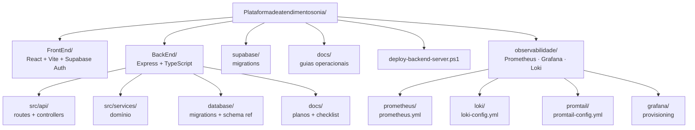

| Pasta | Papel |
|-------|--------|
| **FrontEnd** | UI (Inbox, Agentes, Knowledge, Configuração, Playground). Chama o BackEnd com JWT. |
| **BackEnd** | Orquestra LLM, webhooks Meta/Stripe, fila WhatsApp, RPCs Supabase. |
| **BackEnd/database** | Fonte de verdade do modelo SQL + scripts de inventário. |

---

## Arquitetura de software

### Visão de containers {#visão-de-containers}

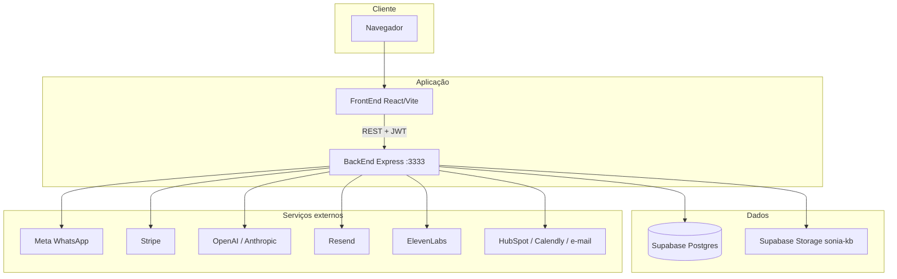

### Camadas do BackEnd {#camadas-do-backend}

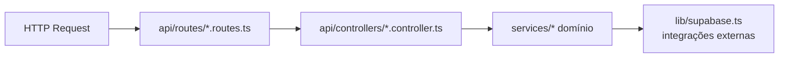

Principais módulos em `BackEnd/src/services/`:

- `agents/` — conversa com LLM, RAG, skills
- `integrations/whatsapp/` — webhook, fila, envio de mensagens
- `flows/` — executor de fluxos visuais
- `governance/` — pré/pós-processamento (planos Enterprise)
- `atendimento-limit-notify.service.ts` — limites de plano e e-mail

Autenticação: middleware `requireAuth` valida JWT Supabase; o e-mail do token identifica o tenant (`tb_company_users`).

### Mapa de módulos (domínio) {#mapa-de-módulos-domínio}

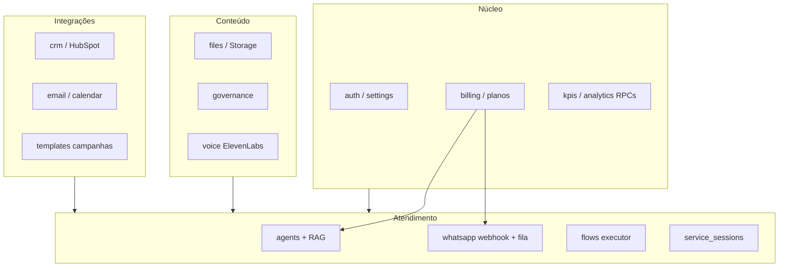

---

## Superfície da API (BackEnd)

Prefixo base: `http://localhost:3333` (ou `VITE_API_URL` no FrontEnd). Rotas **públicas** (webhooks): `/whatsapp/webhook`, `/billing/webhook`, partes de `/crm` e `/calendar`.

| Prefixo | Responsabilidade |
|---------|------------------|
| `/agents` | Chat, configuração LLM, playground (JWT) |
| `/flows` | CRUD e execução de fluxos visuais |
| `/whatsapp` | Webhook Meta, envio, campanhas, templates |
| `/files` | Upload KB, quota, vínculo agente↔arquivo |
| `/billing` | Checkout Stripe, portal, webhook assinatura |
| `/governance` | Políticas de conteúdo (planos com feature) |
| `/kpis` | Métricas e insights (RPCs analytics) |
| `/settings` | Empresa, equipe, integrações |
| `/email`, `/calendar`, `/crm` | Canais e CRM externos |
| `/voice` | Perfis de voz (ElevenLabs) |
| `/templates` | Templates WhatsApp |
| `/cache` | Cache operacional interno |
| `/health` | Health check (sem auth, sem rate limit) |
| `/metrics` | Métricas Prometheus — Bearer token obrigatório, acesso interno |

### Mapa de rotas HTTP {#mapa-de-rotas-http}

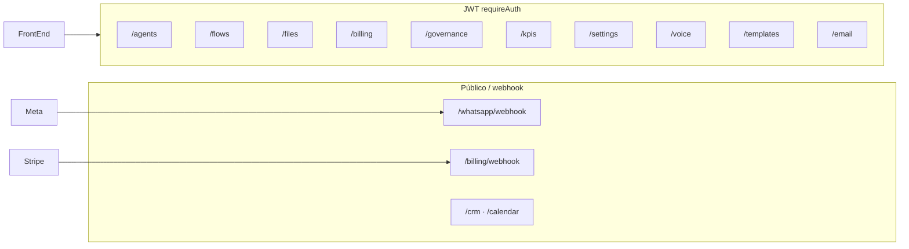

Registro de rotas: [BackEnd/src/index.ts](BackEnd/src/index.ts).

---

## Segurança e multi-tenant

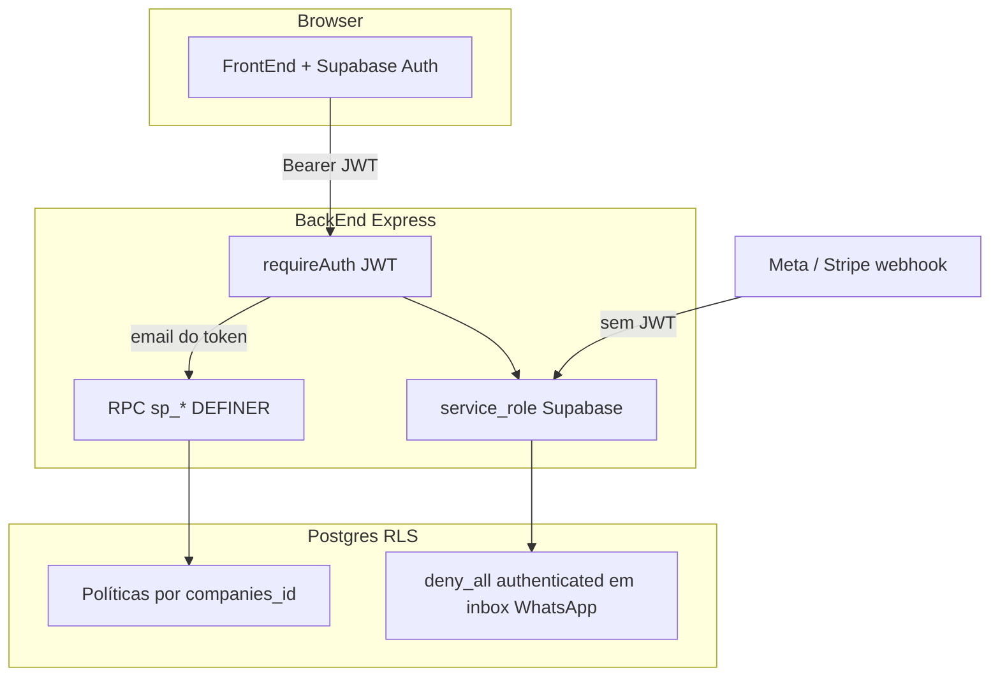

| Camada | Comportamento |
|--------|----------------|
| **JWT (usuário)** | FrontEnd envia token Supabase; BackEnd resolve `companies_id` via email + `tb_company_users`. |
| **RLS** | Todas as 48 tabelas com RLS ligado; inbox WhatsApp (`tb_whatsapp_messages`, contatos) bloqueado para `authenticated` — leitura/escrita via **service role** no BackEnd. |
| **RPC `sp_*`** | ~34 funções `SECURITY DEFINER` validam `p_email` e escopo da empresa (KB, equipe, analytics, login). |
| **Webhooks** | Meta e Stripe entram sem JWT; BackEnd usa credencial de servidor. |

Detalhe de políticas e triggers: [SUPABASE_SCHEMA_REFERENCE.md §6](BackEnd/database/SUPABASE_SCHEMA_REFERENCE.md).

---

## Modelagem de dados

O banco **PostgreSQL (Supabase)** é **multi-tenant** por `tb_companies`. Autenticação: Supabase Auth → `tb_users` + `tb_company_users`.

| Conceito | Tabelas / mecanismo |
|----------|---------------------|
| **Plano** | `tb_subscriptions` — `free`/`inactive` (padrão), `rec_*` (Receptiva), `com_*` (Completa). Trigger `trg_tb_companies_ensure_free_subscription` ao criar empresa. |
| **Atendimento faturável** | `tb_service_sessions` — uma sessão aberta por contato (`uq_tb_service_sessions_one_open_per_contact`). |
| **Automação** | `tb_integrations.automation_mode` (`agent` \| fluxo) + `linked_flow_id` → `tb_flows`. |
| **Knowledge Base** | `tb_files` → `tb_file_sections` (pgvector HNSW) + `tb_file_skills`; vínculo `tb_agent_files`. |
| **Referência SQL** | [SUPABASE_SCHEMA_REFERENCE.md](BackEnd/database/SUPABASE_SCHEMA_REFERENCE.md) (inventário 2026-05-27, blocos 1–10). |

### Núcleo tenant (dados)

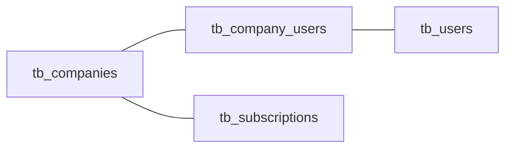

### Diagrama ER (núcleo operacional) {#diagrama-er-núcleo-operacional}

Alinhado ao inventário em produção. Relações satélite (CRM, campanhas, i18n) omitidas no desenho para legibilidade.

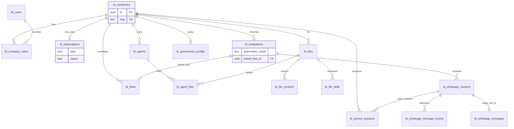

### Caminho de dados — RAG {#caminho-de-dados--rag}

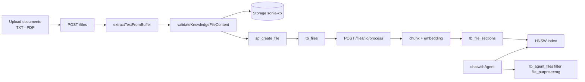

### ER satélites (CRM e eventos)

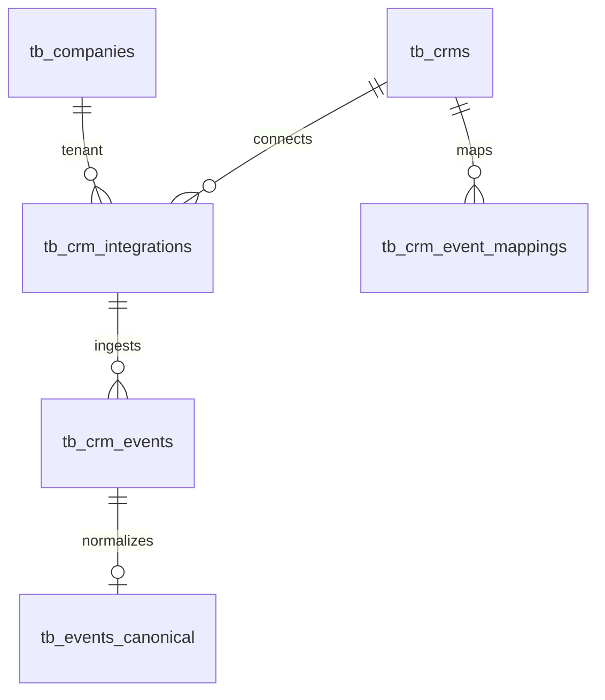

---

## Domínios do banco

Mapa das **48** tabelas `public` (lista completa: [SUPABASE_SCHEMA_REFERENCE.md §2](BackEnd/database/SUPABASE_SCHEMA_REFERENCE.md)).

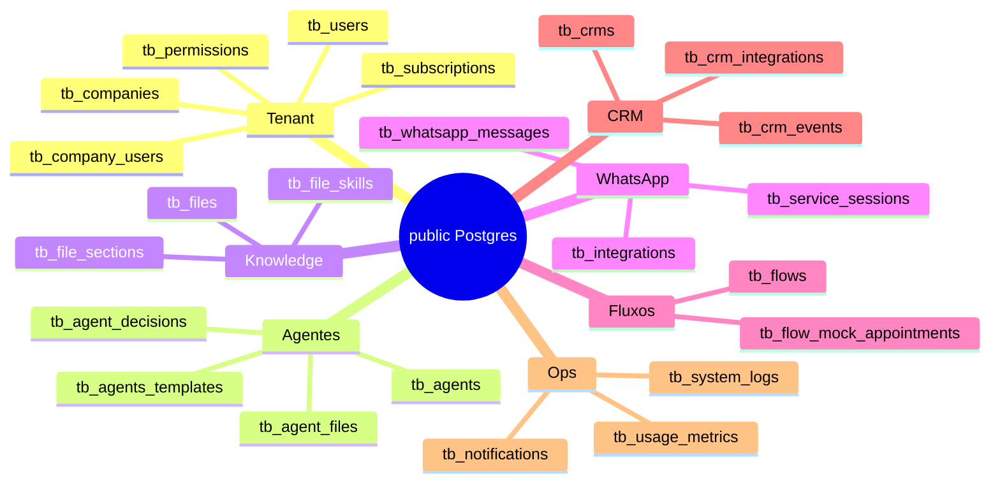

### Planos e gates {#planos-e-gates}

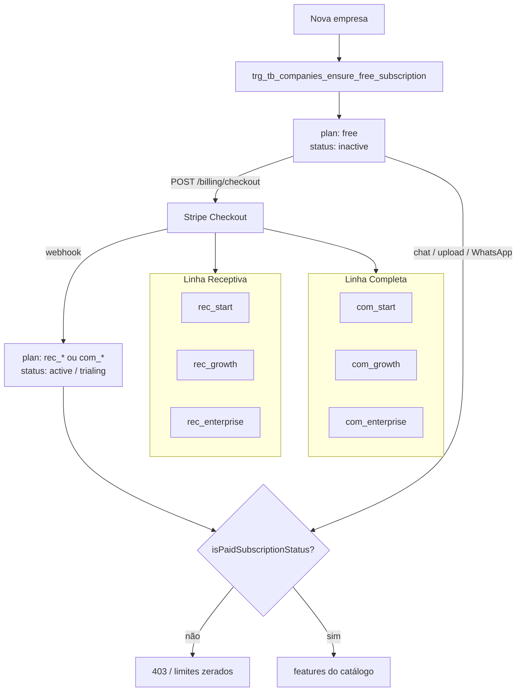

Catálogo: [BackEnd/src/config/plans.catalog.ts](BackEnd/src/config/plans.catalog.ts) · Gates: [plan-helper.ts](BackEnd/src/utils/plan-helper.ts).

### Contexto sistema (atores) {#contexto-sistema-atores}

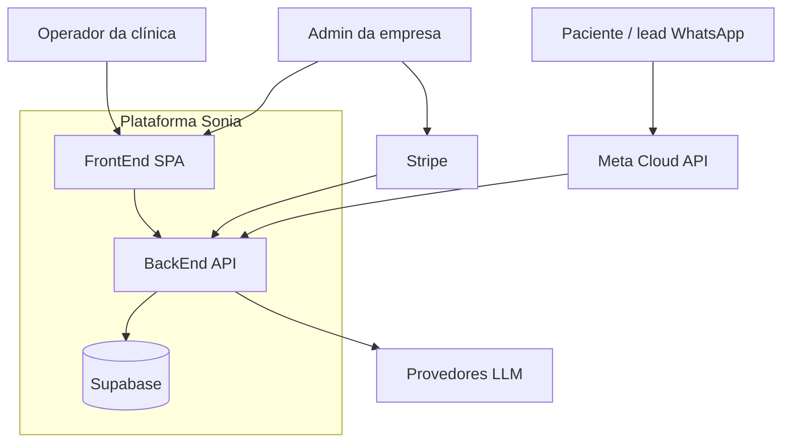

### Atualizar o inventário do Supabase

1. SQL Editor → [SUPABASE_INVENTARIO_READ_ONLY.sql](BackEnd/database/SUPABASE_INVENTARIO_READ_ONLY.sql)
2. Exportar blocos 1–10
3. Reconciliar [SUPABASE_SCHEMA_REFERENCE.md](BackEnd/database/SUPABASE_SCHEMA_REFERENCE.md) e, se necessário, diagramas deste README

---

## Fluxos principais

### Cadastro e tenant

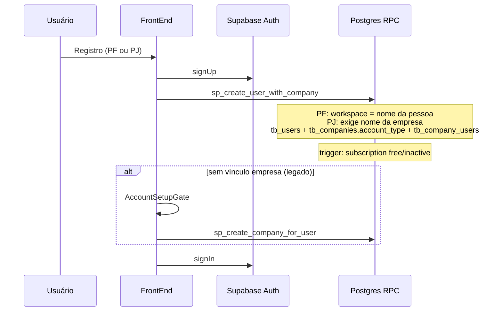

| Tipo | `account_type` | Workspace (`tb_companies.name`) |
|------|----------------|----------------------------------|
| Pessoa física | `individual` | Nome do usuário (ou rótulo informado) |
| Pessoa jurídica | `company` | Nome da empresa (obrigatório) |

Código: [FrontEnd/src/components/auth/AuthPage.tsx](FrontEnd/src/components/auth/AuthPage.tsx), [AccountSetupGate.tsx](FrontEnd/src/components/auth/AccountSetupGate.tsx). SQL: [MIGRATION_ACCOUNT_TYPE_PF_PJ.sql](BackEnd/database/migrations/MIGRATION_ACCOUNT_TYPE_PF_PJ.sql), [SP_CREATE_USER_WITH_COMPANY.sql](BackEnd/database/procedures/SP_CREATE_USER_WITH_COMPANY.sql). Trigger: `trg_tb_companies_ensure_free_subscription` ([MIGRATION_FREE_PLAN_DEFAULT.sql](BackEnd/database/migrations/MIGRATION_FREE_PLAN_DEFAULT.sql)).

### WhatsApp inbound

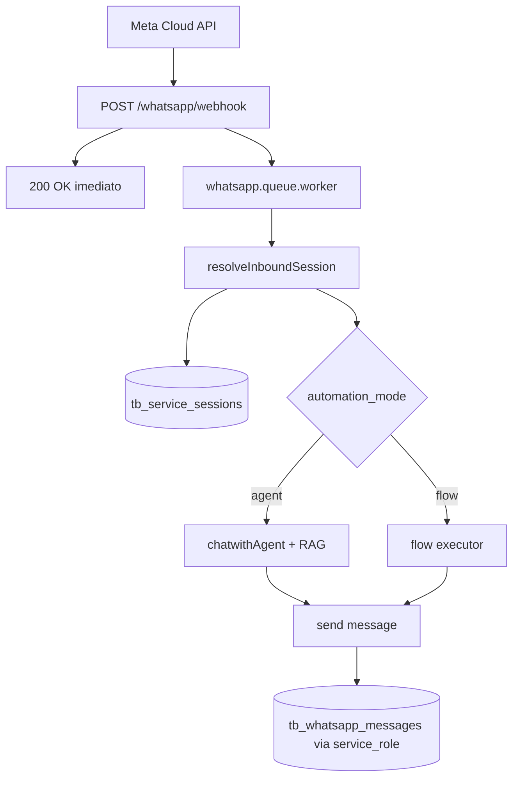

Código: [BackEnd/src/index.ts](BackEnd/src/index.ts), [whatsapp.queue.worker.ts](BackEnd/src/services/integrations/whatsapp/whatsapp.queue.worker.ts). Webhooks: [docs/informacoes-cruciais-integracoes-webhooks.md](docs/informacoes-cruciais-integracoes-webhooks.md).

### Modo fluxo vs agente na integração

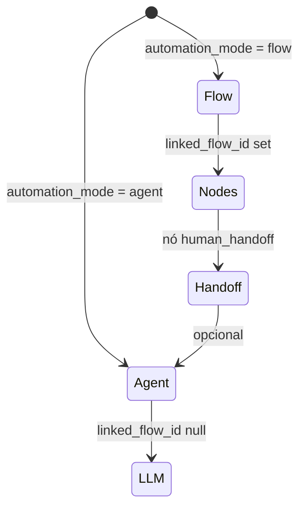

### Atendimento com agente (Playground / Inbox) {#atendimento-com-agente-playground--inbox}

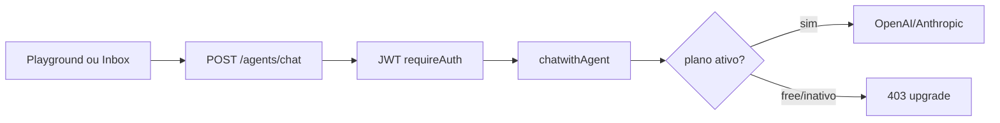

Código: [agents.controller.ts](BackEnd/src/api/controllers/agents.controller.ts), [chatwithAgent.ts](BackEnd/src/services/agents/chatwithAgent.ts), gates em [plan-helper.ts](BackEnd/src/utils/plan-helper.ts).

### Assinatura Stripe

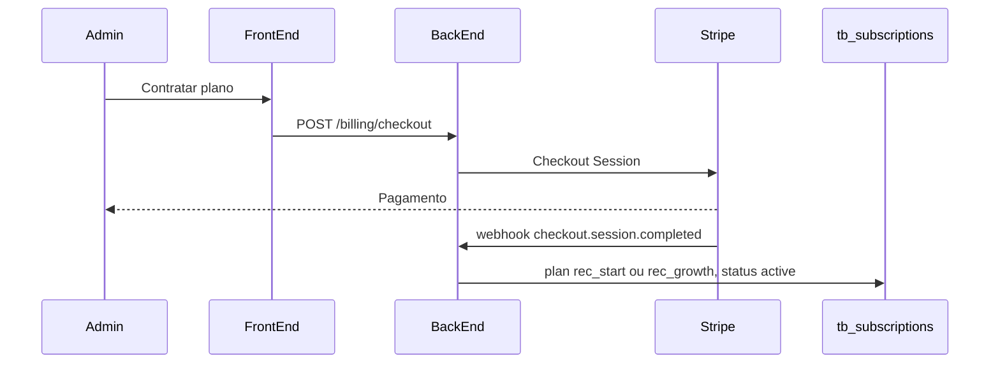

Código: [billing.routes.ts](BackEnd/src/api/routes/billing.routes.ts). Checklist Stripe: [BackEnd/docs/CHECKLIST_MVP_RECEPTIVO.md](BackEnd/docs/CHECKLIST_MVP_RECEPTIVO.md).

### Upload Knowledge Base

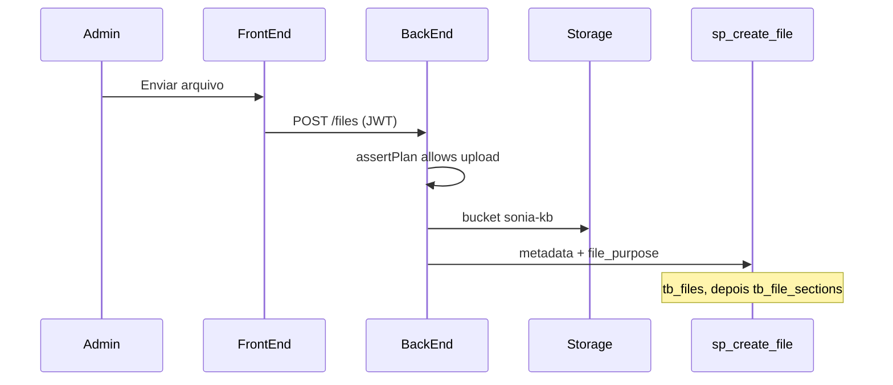

Código: [files.routes.ts](BackEnd/src/api/routes/files.routes.ts), RPCs em [SUPABASE_SCHEMA_REFERENCE.md §4.3](BackEnd/database/SUPABASE_SCHEMA_REFERENCE.md).

### Governança (planos com feature)

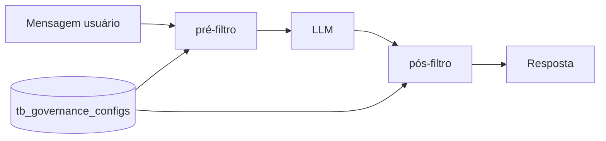

Ativo em planos que expõem governança avançada; runtime em `BackEnd/src/services/governance/`.

---

## Stack e pré-requisitos

| Camada | Tecnologia |
|--------|------------|
| FrontEnd | React 18+, Vite, TypeScript, Tailwind, Supabase JS client |
| BackEnd | Node.js, Express 5, TypeScript, Vitest |
| Banco | Supabase (Postgres 15+), pgvector (RAG), Storage |
| IA | OpenAI, Anthropic (chaves da plataforma no servidor) |
| Pagamentos | Stripe (assinatura mensal) |
| E-mail transacional | Resend |
| Processo (produção) | PM2 — fork mode, autorestart, logs em `BackEnd/logs/` |
| Observabilidade | Prometheus, Grafana, Loki, Promtail, Node Exporter (Docker Compose) |

Variáveis sensíveis ficam em `BackEnd/.env` e `FrontEnd/.env` — **nunca commitar**. Lista operacional: [BackEnd/docs/CHECKLIST_MVP_RECEPTIVO.md](BackEnd/docs/CHECKLIST_MVP_RECEPTIVO.md).

---

## Como rodar localmente

### BackEnd (porta 3333)

```powershell
cd BackEnd
npm install
npm run dev
```

### FrontEnd

```powershell
cd FrontEnd
npm install
```

Configure `FrontEnd/.env` (exemplo):

```env
VITE_SUPABASE_URL=https://seu-projeto.supabase.co
VITE_SUPABASE_ANON_KEY=eyJ...
VITE_API_URL=http://localhost:3333
```

```powershell
npm run dev
```

O FrontEnd usa `VITE_API_URL` quando definido; caso contrário, tenta o host atual na porta `3333`.

### Testes do BackEnd

```powershell
cd BackEnd
npm test
```

---

## Deploy do backend

Comando principal para atualizar o backend no servidor:

```powershell
.\deploy-backend-server.ps1
```

Atalho equivalente:

```powershell
.\deploy-backend-server.bat
```

Esse script:

- empacota o `BackEnd`
- envia para `servidoronsmart@192.168.15.31`
- remove a pasta antiga `BackEnd` no servidor
- remove arquivos antigos de deploy como `BackEnd.zip`, `BackEnd.deploy.zip` e `BackEnd.deploy.tar.gz`
- preserva o `.env`
- instala dependências
- executa `npm run build`
- tenta reiniciar o processo por `pm2` ou `systemctl`

Para validar localmente antes do deploy:

```powershell
.\deploy-backend-server.ps1 -RunLocalTests -RunLocalBuild
```

Configuração padrão atual do script:

- servidor: `servidoronsmart@192.168.15.31`
- pasta remota: `~/plataform-backend`
- processo backend: `backend`

Parâmetros úteis:

```powershell
.\deploy-backend-server.ps1 -Pm2Name "backend"
.\deploy-backend-server.ps1 -RemoteRestartCommand "sudo systemctl restart backend"
```

O fluxo de deploy foi ajustado para Windows → Linux (caminhos com espaço, CRLF, limpeza de artefatos antigos).

### Voz por agente (ElevenLabs)

Configuração na tela do agente. Variáveis no backend:

```env
ELEVENLABS_API_KEY=
ELEVENLABS_DEFAULT_MODEL_ID=
```

Detalhes: [docs/voice-agent-elevenlabs.md](docs/voice-agent-elevenlabs.md).

---

## Observabilidade

Stack completa de observabilidade, operada via Docker Compose em `observabilidade/`. O backend Node.js continua gerenciado pelo PM2 diretamente no Linux — a stack de observabilidade é complementar e não substitui o PM2.

### Stack de observabilidade {#stack-de-observabilidade}

```mermaid
flowchart TB
  subgraph host [Servidor Linux — PM2]
    BE["Backend Node.js :3333<br/>/metrics · /health"]
    PE["Node Exporter :9100<br/>CPU · RAM · disco · rede"]
  end

  subgraph docker [Docker Compose — observabilidade/]
    PROM["Prometheus :9090<br/>coleta e armazena métricas"]
    GF["Grafana :3030<br/>dashboards + alertas"]
    LOKI["Loki :3100<br/>armazenamento de logs"]
    PT["Promtail<br/>coleta logs do PM2"]
  end

  BE -->|scrape /metrics| PROM
  PE -->|scrape :9100| PROM
  PROM -->|datasource| GF
  LOKI -->|datasource| GF
  PT -->|push logs| LOKI
  PM2["/plataform-backend/BackEnd/logs/"] -->|lê arquivos| PT
```

| Ferramenta | Papel | Porta (interna) |
|-----------|-------|-----------------|
| **Prometheus** | Coleta e armazena métricas da API e do servidor | `127.0.0.1:9090` |
| **Grafana** | Dashboards, alertas, exploração de logs | `127.0.0.1:3030` |
| **Node Exporter** | Métricas do servidor Linux (CPU, RAM, disco, rede) | `127.0.0.1:9100` |
| **Loki** | Armazenamento de logs centralizados (Fase 3) | `127.0.0.1:3100` |
| **Promtail** | Coleta logs do PM2 e envia ao Loki (Fase 3) | — |

Todas as portas ficam em `127.0.0.1` — não expostas publicamente. Acesso externo via túnel SSH.

---

### Acesso ao Grafana

**Endereço:** `http://localhost:3030` (após abrir o túnel SSH abaixo)

| Campo | Valor |
|-------|-------|
| Usuário | `admin` |
| Senha | definida em `~/observabilidade/.env` no servidor (`GRAFANA_ADMIN_PASSWORD`) |

**Abrindo o túnel SSH no Windows** (deixar o terminal aberto enquanto usa):

```powershell
ssh -L 3030:localhost:3030 -L 9090:localhost:9090 servidoronsmart@192.168.15.31
```

Acesse no navegador: `http://localhost:3030`

---

### Fases de implementação

| Fase | O que ativa | Status |
|------|-------------|--------|
| 1 — Infra | Prometheus + Grafana + Node Exporter (CPU, RAM, disco) | ✅ Ativo |
| 2 — API | `/metrics` e `/health` no backend + prom-client | ✅ Implementado (requer deploy) |
| 3 — Logs | Loki + Promtail (logs PM2 no Grafana) | Config pronta — subir quando necessário |
| 4 — Alertas | Alertas nativos do Grafana | Configurar no Grafana UI |
| 5 — Erros | Sentry Cloud (stack traces, exceções) | Pendente |
| 6 — Tracing | OpenTelemetry + Grafana Tempo | Pendente |

---

### Comandos operacionais do dia a dia

Todos os comandos abaixo devem ser rodados no servidor, dentro de `~/observabilidade/`.

#### Ver status de todos os serviços

```bash
cd ~/observabilidade
docker compose ps
```

#### Subir todos os serviços (Fases 1 e 2)

```bash
cd ~/observabilidade
docker compose up -d prometheus grafana node-exporter
```

#### Subir serviços de log (Fase 3)

```bash
cd ~/observabilidade
docker compose up -d loki promtail
```

#### Parar todos os serviços

```bash
cd ~/observabilidade
docker compose down
```

> Os dados do Prometheus e Grafana ficam em volumes Docker — não são perdidos ao parar.

#### Reiniciar um serviço específico

```bash
cd ~/observabilidade
docker compose restart prometheus
docker compose restart grafana
docker compose restart node-exporter
```

#### Ver logs de um container em tempo real

```bash
cd ~/observabilidade
docker compose logs -f prometheus
docker compose logs -f grafana
docker compose logs -f node-exporter
docker compose logs -f loki
docker compose logs -f promtail
```

#### Atualizar configuração do Prometheus (ex: token, novo job)

```bash
nano ~/observabilidade/prometheus/prometheus.yml
# editar e salvar

cd ~/observabilidade
docker compose restart prometheus

# Confirmar que recarregou sem erros
curl http://localhost:9090/-/ready
```

#### Verificar saúde de cada serviço

```bash
curl http://localhost:3333/health   # Backend Node.js
curl http://localhost:9090/-/ready  # Prometheus
curl http://localhost:9100/metrics | head -5  # Node Exporter
curl http://localhost:3030/api/health  # Grafana
```

---

### Situações comuns

#### O servidor foi reiniciado — o que subir?

O PM2 reinicia o backend automaticamente (se configurado com `pm2 startup`). Os containers Docker precisam ser levantados manualmente:

```bash
cd ~/observabilidade
docker compose up -d prometheus grafana node-exporter
# Se Loki e Promtail já estiverem ativos:
docker compose up -d loki promtail
```

> Para evitar isso, configure o Docker para iniciar junto com o sistema:
> ```bash
> sudo systemctl enable docker
> ```

#### O Grafana não abre no navegador

1. Confirmar que o túnel SSH está aberto no Windows
2. Verificar se o container está rodando: `docker compose ps`
3. Ver logs do Grafana: `docker compose logs grafana`

#### O Prometheus não está coletando métricas do backend

1. Verificar se o backend respondeu após o deploy: `curl http://localhost:3333/health`
2. Verificar se o `METRICS_BEARER_TOKEN` está definido no `.env` do backend: `pm2 logs backend | head -20`
3. Verificar se o token no `prometheus.yml` é igual ao do `.env` do backend
4. No Grafana → **Explore** → **Prometheus** → digitar `up` — o job `backend-sonia` deve aparecer com valor `1`

#### Trocar a senha do Grafana

```bash
cd ~/observabilidade
nano .env
# alterar GRAFANA_ADMIN_PASSWORD

docker compose down grafana
docker compose up -d grafana
```

#### Ver quanto espaço os volumes estão usando

```bash
docker system df -v | grep obs
```

---

### Importar dashboards no Grafana

#### Dashboard de infraestrutura do servidor (Node Exporter Full)

1. Grafana → **Dashboards** → **Import**
2. No campo "Import via grafana.com" digitar `1860` → **Load**
3. Selecionar **Prometheus** como datasource → **Import**

Mostra: CPU, RAM, disco, rede, filesystem, load average.

#### Dashboard de Node.js (heap, event loop, GC)

1. Grafana → **Dashboards** → **Import**
2. Digitar `11159` → **Load**
3. Selecionar **Prometheus** → **Import**

> Este dashboard só terá dados após o deploy do backend com `prom-client` (Fase 2).

---

### Ativar logs centralizados (Fase 3)

```bash
# 1. Subir Loki e Promtail
cd ~/observabilidade
docker compose up -d loki promtail

# 2. Verificar que o Loki subiu
curl http://localhost:3100/ready

# 3. Descomentar o datasource Loki no Grafana
nano ~/observabilidade/grafana/provisioning/datasources/datasources.yml
# Remover os '#' das linhas do Loki e salvar

# 4. Reiniciar o Grafana para carregar o novo datasource
docker compose restart grafana
```

No Grafana, acessar **Explore → Loki** e filtrar por `{job="sonia-backend"}` para ver os logs do backend em tempo real.

---

### Segurança

- Todas as portas internas em `127.0.0.1` — nunca expostas na internet
- Acesso ao Grafana via túnel SSH (sem abrir porta no firewall)
- `/metrics` protegido por Bearer token (`METRICS_BEARER_TOKEN` no `.env` do backend)
- `/health` sem autenticação — apenas retorna status, sem dados sensíveis
- Credenciais em `~/observabilidade/.env` no servidor (não versionado no git)

Configurações: [observabilidade/](observabilidade/)

---

## Documentação complementar

| Documento | Conteúdo |
|-----------|----------|
| [BackEnd/database/SUPABASE_SCHEMA_REFERENCE.md](BackEnd/database/SUPABASE_SCHEMA_REFERENCE.md) | Schema Postgres, ER, RLS, RPCs |
| [BackEnd/database/SUPABASE_INVENTARIO_READ_ONLY.sql](BackEnd/database/SUPABASE_INVENTARIO_READ_ONLY.sql) | SQL para exportar inventário do banco |
| [BackEnd/docs/PLANOS_E_PERMISSOES.md](BackEnd/docs/PLANOS_E_PERMISSOES.md) | Planos, gates, capacidade |
| [BackEnd/docs/CHECKLIST_MVP_RECEPTIVO.md](BackEnd/docs/CHECKLIST_MVP_RECEPTIVO.md) | Go-live, Stripe, checklist interno |
| [docs/informacoes-cruciais-integracoes-webhooks.md](docs/informacoes-cruciais-integracoes-webhooks.md) | URLs de webhook (Meta, Stripe, Calendly) |
| [docs/planos-permissoes-sonia.md](docs/planos-permissoes-sonia.md) | Permissões e logs de governança |
| [docs/plataforma-sonia-documentacao-tecnica.md](docs/plataforma-sonia-documentacao-tecnica.md) | Documentação de produto (PDF) |
| [docs/prioridades-correcoes-atualizacoes.md](docs/prioridades-correcoes-atualizacoes.md) | Backlog técnico priorizado |

---

## Manutenção da documentação

1. **Migration SQL aplicada no Supabase** → atualize [SUPABASE_SCHEMA_REFERENCE.md](BackEnd/database/SUPABASE_SCHEMA_REFERENCE.md) (tabelas, RPCs, histórico §8) no mesmo PR ou commit imediato.
2. **Mudança de arquitetura ou fluxo** → atualize os diagramas neste README.
3. **Revisão trimestral do banco** → rode [SUPABASE_INVENTARIO_READ_ONLY.sql](BackEnd/database/SUPABASE_INVENTARIO_READ_ONLY.sql) e reconcilie divergências.

Regras Cursor:

- Schema/migrations: [.cursor/rules/supabase-schema-source.mdc](.cursor/rules/supabase-schema-source.mdc)
- Arquitetura/fluxos/API/README: [.cursor/rules/readme-architecture-sync.mdc](.cursor/rules/readme-architecture-sync.mdc)
