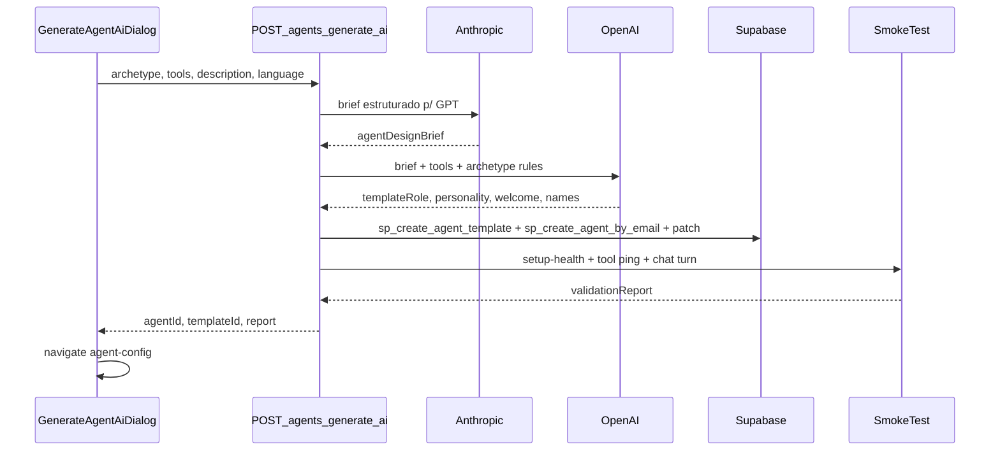

# Plano: Criar agente completo via IA (Hub de Agentes)

**Status:** pendente de implementação  
**Objetivo:** Adicionar no Hub de Agentes um wizard "Criar agente completo via IA" (FAQ / Receptivo / SDR bloqueado), com seleção de integrações/ferramentas, pipeline Claude→GPT para template+agente profissionais, teste automático (setup-health + ping de tools + 1 turno de chat) e entrega do agente já configurado — sem criar fluxo.

---

## Checklist de execução

- [ ] Extrair helpers Claude/GPT/RPC de `flow-generate-mvp` para `agent-ai-generation.shared.ts` e ajustar imports
- [ ] Criar `buildExtraFeaturesFromSelection()` em `agent-extra-features.ts` para serializar tools escolhidas no wizard
- [ ] Implementar `agent-generate-ai.service.ts` (arquétipos FAQ/receptivo/SDR, pipeline Claude→GPT, persistência agente+template)
- [ ] Implementar `agent-generate-smoke-test.service.ts` (setup-health + ping read-only + 1 turno chat interno)
- [ ] Adicionar `GET /agents/generate-ai/status` e `POST /agents/generate-ai` no controller/routes
- [ ] Criar `GenerateAgentAiDialog.tsx` com 6 fases (arquétipo, integrações, brief, generating, validation, done)
- [ ] Integrar botão e dialog em `AgentsHub.tsx` + strings i18n `agentsHub`
- [ ] Testes unitários agent-generate-ai + smoke-test + regressão flow-generate-mvp

---

## Contexto atual

| O que existe | O que falta |
|---|---|
| `FrontEnd/src/components/flows/GenerateFlowAiDialog.tsx` — wizard 3 fases, arquétipos receptivo/SDR | Botão equivalente no Hub de Agentes |
| `BackEnd/src/services/flows/flow-generate-mvp.service.ts` — Claude refine + GPT template 12 seções + `sp_create_agent_template` + `sp_create_agent_by_email` | Endpoint dedicado **sem fluxo** |
| `FrontEnd/src/components/agents/AgentToolsSection.tsx` + `GET /integrations/tools/catalog/for-setup` | Passo de wizard para escolher integrações/ferramentas |
| `BackEnd/src/services/agents/agent-setup-health.service.ts` | Smoke test ampliado (tools + chat interno) |

O fluxo alvo **não cria canvas de fluxo** — apenas **1 template** (`tb_agents_templates.role`) + **1 agente** (`tb_agents`) com `extra_features`, `personality_prompt`, `integrations_id` e `crm_integration_id` conforme seleção.



---

## 1. Backend — novo serviço e endpoint

### 1.1 Serviço principal

Criar `BackEnd/src/services/agents/agent-generate-ai.service.ts` extraindo/reutilizando de `BackEnd/src/services/flows/flow-generate-mvp.service.ts`:

- **Tipos:** `AgentAiArchetype = 'faq' | 'receptive' | 'sdr'`
- **Entrada:**
  - `description`, `language`, `archetype`
  - `agentName?`
  - `selectedTools[]`: `{ toolKey, provider, toolName, integrationId?, crmIntegrationId?, config? }`
  - `integrations`: `{ whatsappIntegrationId?, calendlyIntegrationId?, crmIntegrationId? }`

**Pipeline em 4 etapas (logadas para UI de progresso):**

1. **Claude — design brief** (novo prompt, não só “refinar descrição”):
   - Consolida arquétipo, finalidade do usuário, ferramentas escolhidas e regras de negócio.
   - Saída: parágrafo estruturado + bullets de comportamento por tool (input para GPT).

2. **GPT — geração estruturada** (reutilizar shape de `generateSingleAgentConversationPlanWithOpenAI`):
   - JSON: `conversationTemplate` (12 seções já usadas no fluxo IA), `personalityPrompt`, `welcomeMessage`, `agentDisplayName`, `templateDescription`.
   - Injetar obrigatoriamente:
     - `BackEnd/src/services/agents/agent-integration-tools-prompt.ts` → `PLATFORM_TEMPLATE_INTEGRATION_TOOLS_SECTION`
     - `BackEnd/src/content/flexible-scheduling-template-pack.ts` → `JSON_RESPONSE_RULES` quando houver tools Calendly
     - Apêndices por arquétipo (ver §1.3)

3. **Persistência:**
   - `sp_create_agent_template` → nome prefixado `[AGENTE IA]`
   - `sp_create_agent_by_email` → vinculado ao template
   - Patch em `tb_agents`:
     - `extra_features` via nova helper `buildExtraFeaturesFromSelection(selectedTools)` em `BackEnd/src/services/agents/agent-extra-features.ts`
     - `personality_prompt`, `integrations_id` (WhatsApp se selecionado), `crm_integration_id` (HubSpot se selecionado)
   - Respeitar `canCreateAgent()` como em `BackEnd/src/api/controllers/agents.controller.ts` → `createAgent`

4. **Smoke test** (config + tools + chat):
   - `BackEnd/src/services/agents/agent-setup-health.service.ts` → `getAgentSetupHealth`
   - Novo `BackEnd/src/services/agents/agent-generate-smoke-test.service.ts`:
     - **Ping read-only por tool habilitada:**
       - Calendly: `list_event_types`
       - HubSpot: `lookup_contact` com e-mail fictício de teste (sem criar dado)
       - WhatsApp: validar integração existe + token (sem enviar mensagem real na v1)
       - Email: validar integração ativa
     - **1 turno de chat interno:** chamar `runAgentConversationTurn` com mensagem sintética por arquétipo:
       - FAQ: `"Qual o horário de atendimento?"`
       - Receptivo: `"Quero marcar uma reunião amanhã de tarde"`
     - Validar: resposta JSON parseável, `action` válida; se receptivo+Calendly → esperar `integration_tool` ou `reply` coerente (marcar `warn` se só texto)

**Se smoke test falhar em checks críticos (`fail`):** retornar agente criado + `validationReport.ok=false` + mensagens acionáveis (UI mostra aviso, não apaga agente).

**SDR:** rejeitar com `501` / mensagem `"IA SDR em desenvolvimento"` (igual `generateMvpFlowFromDescription` em flow-generate-mvp).

### 1.2 Arquétipos e presets de tools

| Arquétipo | Comportamento base | Tools sugeridas (pré-selecionadas no wizard) |
|---|---|---|
| **FAQ** | Template focado em dúvidas, tom consultivo, sem fluxo rígido de agenda | Nenhuma obrigatória; se usuário marcar HubSpot → lookup/create |
| **Receptivo** | Base inspirada em `flexible-scheduling-template-pack.ts` + contexto do negócio via GPT | Calendly (4 tools agenda) + HubSpot (lookup/create/update) + WhatsApp (session) quando conectados |
| **SDR** | Bloqueado na UI e no backend | — |

Para o **primeiro caso de uso** (receptivo + Calendly + WhatsApp): o preset receptivo pré-marca essas tools quando as integrações existirem no catálogo.

### 1.3 Refatoração compartilhada (evitar duplicação)

Extrair para `BackEnd/src/services/agents/agent-ai-generation.shared.ts`:

- `refineDescriptionWithClaude/OpenAI` (de flow-generate-mvp)
- `generateAgentTemplatePlanWithOpenAI(brief, archetype, tools)`
- `appendSingleAgentTemplateFooter`, `appendUserProvidedUrlsBlock`
- RPC helpers `rpcCreateAgentTemplate`, `rpcCreateAgent`, `patchAgentRecord`

`BackEnd/src/services/flows/flow-generate-mvp.service.ts` passa a importar esses helpers (comportamento existente preservado).

### 1.4 API

Em `BackEnd/src/api/routes/agents.routes.ts` e `BackEnd/src/api/controllers/agents.controller.ts`:

| Método | Rota | Função |
|---|---|---|
| `GET` | `/agents/generate-ai/status` | Claude disponível + integrações conectadas (proxy do catalog/for-setup) |
| `POST` | `/agents/generate-ai` | Orquestra geração + smoke test |

**Body `POST /agents/generate-ai`:**

```typescript
{
  description: string
  language: string
  archetype: 'faq' | 'receptive' | 'sdr'
  agentName?: string
  selectedTools: AgentToolSelection[]
  integrations?: { whatsappIntegrationId?, calendlyIntegrationId?, crmIntegrationId? }
}
```

**Response:**

```typescript
{
  success: boolean
  agent: { id, nome, templateId, templateName }
  validationReport: { ok, checks[], chatTurn? }
  refinedBrief: string
  generationSteps: { id, label, status }[]
}
```

---

## 2. Frontend — wizard no Hub de Agentes

### 2.1 Novo componente

Criar `FrontEnd/src/components/agents/GenerateAgentAiDialog.tsx` espelhando padrões de `FrontEnd/src/components/flows/GenerateFlowAiDialog.tsx`:

**Fases do dialog:**

1. **`archetype`** — cards FAQ / Receptivo / SDR (SDR com `Lock`, disabled)
2. **`integrations`** — reutilizar lógica visual de `AgentToolsSection.tsx`:
   - Fetch `GET /integrations/tools/catalog/for-setup`
   - Agrupar por provider (Calendly, HubSpot, WhatsApp, Email)
   - Switch por ferramenta + select de conta conectada
   - Presets por arquétipo ao entrar na fase
   - Validar: receptivo exige ao menos 1 integração conectada; tools selecionadas precisam de `integrationId` quando aplicável
3. **`brief`** — nome do agente, idioma (`FrontEnd/src/lib/agent-language.ts`), textarea descrição + botão “Melhorar descrição”
4. **`generating`** — checklist animado (Brief Claude → Template GPT → Criar recursos → Testar)
5. **`validation`** — exibir `validationReport` (checks ok/warn/fail + resultado do chat simulado)
6. **`done`** — botão “Abrir agente” → `navigate('agent-config?id=...')`

### 2.2 Integração no Hub

Em `FrontEnd/src/pages/AgentsHub.tsx`:

- Novo botão no header ao lado de **Implantar nova Sonia**:
  - Label: `Criar agente com IA` (ícone `Sparkles`)
- Estado `isGenerateAgentAiOpen` + refresh `fetchAgents()` no sucesso
- i18n: chaves em `FrontEnd/src/i18n/local-seed-resources.ts` namespace `agentsHub`

---

## 3. Caso de uso inicial: receptivo + Calendly + WhatsApp

Fluxo esperado após implementação:

1. Abrir wizard → **Receptivo**
2. Etapa integrações: marcar Calendly (4 tools) + WhatsApp (`send_session_message`) + selecionar contas conectadas
3. Descrever tema/finalidade do negócio
4. Sistema gera template profissional (12 seções + regras Calendly flex + WhatsApp)
5. Smoke test roda `list_event_types`, valida WhatsApp link, simula chat `"Quero marcar uma reunião..."`
6. Agente aparece no Hub já com tools ligadas; usuário pode ajustar voz/RAG depois em `agent-config`

---

## 4. Testes

| Arquivo | Cobertura |
|---|---|
| `BackEnd/src/__test__/agent-generate-ai.service.test.ts` | SDR bloqueado; FAQ sem tools; receptivo monta `extra_features`; falha de plano |
| `BackEnd/src/__test__/agent-generate-smoke-test.service.test.ts` | Mocks de toolkit + chat turn |
| Ajuste em `BackEnd/src/__test__/flow-generate-mvp.test.ts` | Garantir refactor shared não quebrou fluxo IA |

---

## 5. Deploy e operação

- Redeploy backend (novos endpoints) + front
- Nenhuma migration nova (usa `meta_app_secret`, `extra_features`, RPCs existentes)
- Pré-requisitos para o caso receptivo: Calendly + WhatsApp conectados em Integrações

---

## Riscos e mitigações

| Risco | Mitigação |
|---|---|
| GPT gera template sem regras de tools | Brief Claude + injeção fixa de `PLATFORM_TEMPLATE_INTEGRATION_TOOLS_SECTION` + footer Calendly |
| Smoke test lento (LLM + APIs) | Timeout por etapa; UI com progresso; chat turn com `maxTokens` baixo |
| Chat simulado não dispara tool na v1 | Marcar `warn`, não bloquear entrega se setup-health + tool ping OK |
| Duplicação com fluxo IA | Shared module + prefixos distintos `[AGENTE IA]` vs `[FLUXO IA]` |
